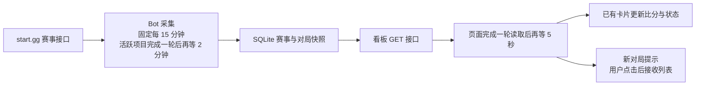

# start.gg 监控看板：自动更新与比赛体验专项审阅

日期：2026-09-26  
源码基线：`d8e1c23e4899b326d94e2be0ee526075972627ae`  
工作阶段：调研与诊断  
范围：start.gg 看板前端、代理接口、Bot 内部接口、赛事采集与调度主路径。

## 一、结论

**目前有自动更新，也已有针对比赛阅读的体验设计。** 页面自动读取本地快照，后台按不同节奏采集 start.gg；页面框架常驻、赛事详情缓存、分页复用、新对局主动接收等机制都已存在。

当前更适合定时关注赛果。持续盯住一场正在进行的比赛时，主要短板是：**场间空隙会退出加速采集、监控状态与具体项目的新鲜度表达不够直接，以及筛选、跨赛事返回和移动端跳转的连续性还未完整收尾。**

建议优先完善现有采集节奏和交互主路径，继续使用现有轮询机制。缩短页面读取间隔本身不会让上游尚未采到的比赛更早出现。

### 证据边界

- 本文依据当前源码、当前依赖实现及必要的公开 API 文档；既有 `doc` 内容没有用作事实依据。
- “确定行为”表示能从控制流直接得到；“条件问题”会写明触发条件；“优化机会”表示产品取舍，不等于已发生故障。
- 页面实际帧率、网络耗时、布局观感、真实比赛期间的端到端延迟，不由静态源码推定。本文没有把某个条件风险表述为已经发生的线上事故。
- 本次产出为专项报告；下文建议是后续实现范围的候选项。

## 二、自动更新到底如何工作

| 场景 | 当前行为 | 直接依据 |
| --- | --- | --- |
| 开始或恢复监控 | 先进行一次业务采集，再开启定时器 | `src/services/startgg/control.ts:13`、`:39` |
| 固定采集 | 每小时北京时间 00、15、30、45 分执行；包含预设选手同步、赛事发现、种子准备和当前项目采集 | `src/scheduled/jobs.ts:99`、`:136`；`src/services/startggPresetSync.ts:314` |
| 加速采集 | 发现活跃项目后，上一轮完成再等 2 分钟，采集对应项目；通常不刷新赛事元数据和缺失选手映射 | `src/scheduled/jobs.ts:69`、`:84` |
| 页面自动读取 | 顺序读取总览、关注信息、当前赛事详情及当前操作；整轮完成后再等 5 秒 | `apps/startgg-dashboard/src/composables/useBoardData.ts:98` |
| 页面隐藏与恢复 | 隐藏时停止安排下一轮；恢复可见立即读取；在途请求可以继续完成 | `useBoardData.ts:117`、`:190` |
| 后台监控暂停 | 停止上游定时采集，页面仍继续读取本地状态和已有数据 | `src/scheduled/jobs.ts:144`；`useBoardData.ts:98` |
| 页面“重新读取页面数据” | 读取本地接口，不直接请求 start.gg | `App.vue:55`；`useBoardData.ts:123`；`src/services/startgg/dashboardApi.ts:63` |
| “立即同步比赛” | 提交后台操作，进行一次同步；不会自动恢复暂停的监控，可能产生正常的 Telegram 比赛通知 | `OperationsDrawer.vue:50`；`src/services/startgg/control.ts:13` |
| 完赛停止 | 固定采集结束后检查无项目或全部官方完赛，并关闭轮询 | `src/scheduled/jobs.ts:108` |
| Bot 重启 | 恢复持久化开启状态对应的固定采集；没有立即采集或立即重建加速轮询 | `src/scheduled/jobs.ts:154` |

其中前端简称均位于 `apps/startgg-dashboard/src/`，组件位于其 `components/` 目录。

### 两个重要含义

1. **页面 5 秒读取不等于 start.gg 每 5 秒更新。** 真正看到结果的时间取决于赛事方录入、上游被采到的时机、队列与请求耗时、页面下一轮读取。15 分钟和 2 分钟都不能直接当作端到端延迟保证。业务任务和上游请求各有串行限制，赛事也逐个处理：`taskQueue.ts:4`、`client.ts:52`、`tracker.ts:836`。
2. **“完整同步”指当前监控范围及其元数据。** 对局覆盖关注选手、已选 Top 16/32 种子及已识别决赛阶段，并非整个赛事所有对局。界面已有“仅含已采集对局”的范围说明：`tracker.ts:479`、`:759`；`EventNavigator.vue:27`；`ResultsFeed.vue:67`。

## 三、已经做好的比赛体验

| 能力 | 现有实现与效果 | 位置 |
| --- | --- | --- |
| 框架常驻、局部读取 | 后台刷新不清空总览或详情；只有首次无缓存才显示局部占位 | `App.vue:28`、`:52`；`useBoardData.ts:108` |
| 赛事与分页复用 | 详情按赛事缓存；最多保留 12 个 EventBoard 实例；页签用 v-show；分页按赛事、来源、选手保存 | `App.vue:54`；`EventBoard.vue:30`；`ResultsFeed.vue:11` |
| 减少列表跳动 | 保留已接受列表顺序，新对局通过提示主动接收；已有对局继续更新比分及完成状态 | `RecentMatches.vue:9`；`ResultsFeed.vue:13` |
| 比赛信息表达 | 有进行中、胜者、关注标记、来源、时间及对局链接；状态并非只靠颜色 | `MatchCard.vue:9` |
| 选手与赛果联动 | 可以按选手、胜败者组状态、赛果来源筛选；选手卡可进入其已采集对局 | `PlayersPanel.vue:7`、`:18`；`EventBoard.vue:18` |
| URL 保留阅读条件 | 页签、搜索、状态、选手及来源写入 query；浏览器历史能带回这些条件 | `EventBoard.vue:13`、`:17`；`ResultsFeed.vue:14` |
| 滚动位置 | 同路径 query 变化不主动滚动；跨路径保存位置，浏览器后退使用历史位置 | `main.ts:5` |
| 失败事实可见 | 连接断开、采集失败、Telegram 通知失败有不同提示；连接失败明确指出内容是上次读取结果 | `App.vue:43`；`EventBoard.vue:27` |
| 管理操作反馈 | 提交后有排队、执行、完成、失败状态；关闭面板不取消已接受任务；暂停会等待本轮结束 | `useBoardData.ts:124`；`OperationsDrawer.vue:46` |
| 基础移动与键盘支持 | 响应式布局、可见焦点、原生模态 dialog、Escape 关闭、部分减少动画处理已有实现 | `style.css:34`、`:265`；`OperationsDrawer.vue:42` |

因此，现有实现没有“自动刷新必然整页重挂、清空所有筛选和分页”的源码问题。需要继续完善的是下面这些具体路径。

## 四、优先处理项（由高到低）

以下“高、中、低”用于本次专项内排序，不重写此前全仓审计的编号或优先级。

### U01 · 高：普通阶段场间空隙会结束加速采集

**类型：确定行为，直接影响持续观赛。**

`src/scheduled/jobs.ts:70` 在活跃项目集合为空时清掉加速计时器。普通阶段的活跃依据是关注选手或种子是否有 `startedAt` 非空且 `completedAt` 为空的对局：`src/services/startgg/tracker.ts:346`、`:582`、`:854`。

一场结束而下一场尚未标记开始时，项目会退出加速集合；接下来可能等到下一次固定采集才发现新对局。对局较短时，用户可能只看到后来补进来的完赛结果。已识别决赛阶段已有不同处理：只要阶段曾开赛且赛事未完成，即使当前没有进行中对局仍维持活跃，见 `tracker.ts:682`。

**建议：**明确普通阶段“持续观赛”的业务条件，基于项目仍在进行、关注对象仍在参赛的事实保持采集节奏；以真正结束监控范围作为退出条件。使用已有赛事和选手状态即可，不必为场间休息增加复杂状态系统。

### U02 · 高：切换赛事后，旧请求会阻塞新赛事并传播旧错误

**类型：条件问题；切换发生在旧赛事读取过程中。**

`apps/startgg-dashboard/src/composables/useBoardData.ts:98` 用一个全局 `reading` 锁串行整轮读取。正在读取 A 时进入 B，路由刷新会因该锁直接返回。A 详情慢时，B 要继续等；A 详情发生非 404 错误时，全局 `showFailure` 会停止后续读取，使尚无缓存的 B 也停在首次加载占位。

依据：`useBoardData.ts:45`、`:100`、`:112`、`:114`、`:191`；`api.ts:3`。当前结果按 eventId 存储，因此这里不是 A 的数据覆盖 B，而是错误范围和等待关系不合理。

**建议：**当前赛事详情拥有自己的请求与错误范围；切换时取消失去用途的详情请求，已访问赛事的结果仍按身份存储。失败直接在对应范围呈现，避免旧赛事失败阻断新赛事的正常读取。

### U03 · 高：首次打开或整页刷新时，外部字体可能阻止开场层退出

**类型：条件问题；已声明字体的某个字体文件加载失败。**

`apps/startgg-dashboard/src/main.ts:15` 先等待全部字体加载，才给全屏开场层添加退出状态并删除它。任一字体加载拒绝后，后续两步都不会执行；`index.html:15` 的全屏层会继续覆盖已经挂载的 App。`FontFaceSet.load()` 的 Promise 在字体失败时拒绝，这是公开 API 行为。[MDN 文档](https://developer.mozilla.org/en-US/docs/Web/API/FontFaceSet/load)

**建议：**将页面可用时机与外部字体下载解耦，让字体作为样式资源正常加载。自动读取本身不重新播放开场层，本项针对首次进入与用户整页刷新。

### U04 · 中：监控开关、采集中状态和项目新鲜度需要更直接地对应

**类型：已有提示基础上的体验优化。**

顶部已有监控开关、最近采集时间和错误提示；每个项目也有 snapshotAt。这些基础信息应保留。但还存在三个具体差异：

- 快采集更新全局 lastSuccessAt，只说明这轮目标项目成功；不能据此认为其他项目也同样新。依据：`tracker.ts:846`；`dashboardRepository.ts:32`。
- `fastPollingEnabled` 实际表示加速计时器当前存在。计时器一触发就置空，在采集进行时会变成 false，而非整个加速策略被主动关闭。依据：`src/scheduled/jobs.ts:77`、`:172`。
- 暂停或读取失败后，MatchCard 仍仅依据比赛时间字段展示动态“进行中”。顶部虽有解释，滚动到卡片附近时仍可能把旧快照当成即时状态。依据：`MatchCard.vue:6`；`App.vue:39`、`:43`。

**建议：**顶部区分“正在采集”和“等待下一次采集”；当前赛事突出其自身采集时间，并用已有下一次采集时间解释等待。停止采集或该项目失败时，卡片可写“上次采集时进行中”，保留真实赛况字段。

### U05 · 中：筛选某位选手时，其他选手的新赛果也会提醒

**类型：确定的提示范围不一致。**

`ResultsFeed.vue:18` 对整个项目 incoming 判断 hasNew；来源和选手筛选到 `:25` 才用于可见列表。查看选手 A 时，B 的新比赛也可能触发提示，点击后却重新读取 A，列表没有变化。决赛固定来源的父组件已过滤数据，不宜把影响扩大到全部场景。

**建议：**按当前来源和选手范围比较新增、刚结束对局，使提示与点击后用户能看到的内容一致。

### U06 · 中：手机上从选手卡进入赛果，没有位置与焦点交接

**类型：明确的交互缺口；影响程度取决于当前滚动位置和列表长度。**

`EventBoard.vue:18` 只改 query、等待渲染并读取结果；`main.ts:9` 对同路径导航不滚动。移动布局把结果区放在选手区上方：`style.css:268`。用户在下方选手卡点击“已采集对局”时，上方结果已变化，但视口及焦点仍留在原位置。

**建议：**把这次明确导航动作的阅读位置与焦点交给结果区标题，同时用选手姓名表达当前筛选。普通后台刷新继续保持阅读位置。

### U07 · 中：侧栏重访赛事时，筛选恢复与滚动恢复不一致

**类型：状态保持优化。**

在 A 设置页签、选手和来源后，通过侧栏到 B，再通过侧栏返回 A，`EventNavigator.vue:21` 的链接只包含路径。页签和筛选来自全局 route.query，因此会回到默认条件；与此同时 `main.ts:9` 仍可能恢复 A 的旧滚动位置。KeepAlive 保留组件和分页缓存，无法替代 query 的恢复。

**建议：**侧栏重访使用该赛事上次的完整路由条件；浏览器后退继续使用原生历史行为。需要保留的是一组一致的赛事、筛选和阅读位置。

### U08 · 中：当前项目更新、赛事发现与历史项目刷新可以更贴合操作目的

**类型：业务入口优化。**

目前“立即同步比赛”通过 `control.ts:17` 调用 `startggPresetSync.ts:314`，先做赛事发现再采集。用户只是想看到正在阅读的这场比赛最新比分，也要等待这条完整链路。

自动订阅且已完赛的项目会被设为 inactive，见 `startggRepository.ts:378`；采集器仅处理 active，见 `tracker.ts:825`。因此历史详情每 5 秒读取，以及点击全局同步，都不意味着该历史赛事会向上游重新采集。

**建议：**增加语义清晰的“更新当前项目”，直接采集已知项目；赛事发现继续使用现有发现入口。历史项目也可按用户明确动作更新一次，操作是否产生 Telegram 消息需要在入口上说清楚。仅刷新网页、本地读取和上游采集继续保持区别。

## 五、下一顺序的针对性优化

| 优先级 | 具体机会 | 源码依据 | 最小方向 |
| --- | --- | --- | --- |
| 中 | 新关注选手尚未解析赛事映射，快采集就把状态从等待采集变成 not_entered；看板文案为“未匹配到参赛记录” | `control.ts:116`；`tracker.ts:275`、`:323`；`src/scheduled/jobs.ts:89`；`format.ts:12` | 添加时补对应映射，或保持明确的“等待首次采集”；不要把“没有执行匹配”表达成匹配已经完成 |
| 中 | 决赛视图要求赛事方存在 2–8 个种子的独立 Phase；整场只有一个大 Phase 时，进入 Top 8 也不一定能识别 | `tracker.ts:407`、`:677`、`:724`；`EventBoard.vue:37` | 保留官方阶段的准确表达；有完赛名次时可独立呈现最终排名，不要求先存在小规模阶段 |
| 低 | 本地搜索、状态筛选、页签切换都能触发 board/following/detail 整轮读取 | `PlayersPanel.vue:13`；`EventBoard.vue:17`；`useBoardData.ts:191` | 路由引发的数据读取只响应赛事身份或页面范围变化；本地筛选用现有计算结果。已有 reading 会合并部分触发，不应声称每个按键必然发一整轮请求 |
| 低 | 手动同步已完成的提示可能先于对应新快照出现 | `useBoardData.ts:106`、`:113`；`OperationsDrawer.vue:46` | 本会话操作首次完成后，及时读取受影响的数据。当前只是下一轮前的短暂不同步，不是结果永久丢失 |
| 低 | 接收新结果后只消失提示，没有指出具体新增或刚结束的卡片 | `RecentMatches.vue:10`、`:24`；`ResultsFeed.vue:18`、`:27` | 标出本次新增和刚结束的对局，使用简短文字即可；已有比分继续就地更新 |
| 低 | 新结果提示没有读屏状态播报，页签选中态只有样式 | `ResultsFeed.vue:65`；`RecentMatches.vue:24`；`EventBoard.vue:29` | 补充适量状态播报、选中语义及内容关联，保留当前键盘可操作按钮 |
| 低 | 发现列表或待确认列表较长时，确认区域在列表之后，点击选项后可能不在视口内 | `OperationsDrawer.vue:47`、`:48` | 让确认区域靠近被选赛事，或在明确选择动作后把位置与焦点交给确认区域 |

异步状态播报、可访问名称、焦点和 URL 状态等审阅点参考了最新 [Web Interface Guidelines](https://raw.githubusercontent.com/vercel-labs/web-interface-guidelines/main/command.md)。表中的建议只针对本项目已有交互，不要求整体更换组件或架构。

## 六、建议的实施顺序与完成表现

| 顺序 | 范围 | 用户应该直接感受到的结果 |
| --- | --- | --- |
| 第一批 | U01–U03 | 普通阶段两场之间继续及时采集；切换赛事不受旧赛事请求牵制；页面可用不依赖字体全部下载完成 |
| 第二批 | U04–U07 | 知道当前赛事的数据有多新；新赛果提示与筛选一致；点选手能直接看到对应结果；侧栏往返恢复完整阅读状态 |
| 第三批 | U08 及第五节 | 当前项目更新路径更直接，历史刷新含义清楚，新关注选手、最终排名及操作反馈更完整 |

自动刷新已经具备完整的基本链路。后续价值最大的改进集中在**比赛持续更新、变化可察觉、阅读位置稳定和动作结果就近呈现**，现有缓存、局部渲染、新结果主动接收等能力可以直接沿用。
