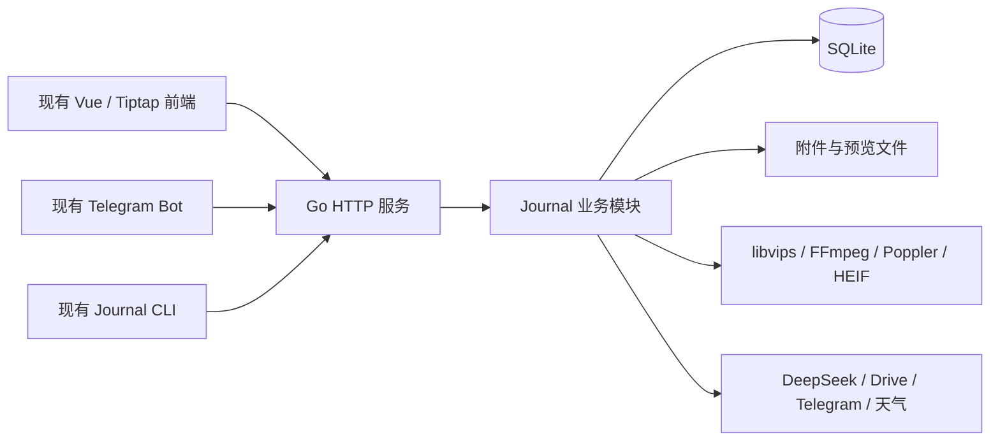

# Journal 后端 Go 重构方案

调研日期：2026-10-05。状态：待评审，尚未进入功能实现或环境部署阶段。

本次已从干净的本地 `main` 创建并切换到 `refactor/journal-go`，方案与后续重构使用该分支。本次交付只新增本文档，未提交、推送或修改生产环境。

## 1. 建议采用的方向

**将 Journal 后端整体迁移为一个 Go 服务，保留 Vue 前端、现有 HTTP 接口、SQLite 数据和附件布局；在独立验收环境逐批完成业务能力，全部收尾后再进行一次生产切换。**

推荐组合：**Go 1.27.1 + chi + SQLite / go-sqlite3 + sqlc + goose + tusd + govips**。文章处理采用 **Goldmark、HTML 解析与清理库，加上 Journal 自身的富文本格式适配**。外部服务优先使用维护中的 Go SDK。

“全部迁移为 Go”的完成含义是：Journal 请求处理、数据库操作、文章转换、上传、媒体编排和 AI 编排均由 Go 承担，后端运行镜像不再包含 Node、tsx、npm 依赖或执行 JavaScript 的桥接服务。前端的 Vue/Tiptap 和前端产物工具链继续保留；独立部署的 Telegram Bot、其他应用以及作为调用端的 Journal CLI 不属于这次重写范围。

Go 有利于统一后端类型、并发与取消机制，也有机会减少常驻资源占用；但**目前没有 Journal 的运行数据能够证明换语言会带来多少提速**。现有 SQLite、图片处理和视频/PDF 工具已经大量使用原生实现，外部模型和网盘耗时也不会因 Go 自动消失。本次确定的业务价值是后续服务端开发进入 Go 生态，性能收益作为验收时需要观察的结果。

## 2. 当前实现与迁移边界

### 2.1 证据范围

本方案依据当前工作区源码、依赖声明、本地已安装包源码及上游公开资料，不引用历史设计文档或本仓库提交记录。

本地包文件显示：Fastify 5.12.5、better-sqlite3 13.0.3、Tiptap HTML 3.31.3、tus server 2.4.5、Sharp 0.35.4。它们是本地依赖状态，不代表生产容器内的实际版本。

部署位置依据项目约定；容器限额、镜像内容和发布动作依据仓库配置。生产数据库实际版本、数据量、服务器余量、正在使用的镜像及反代配置，需要在实施环境阶段从 `rndc02` 的实际状态确定。本文不把这些运行时信息当作已经确认的事实。

### 2.2 必须覆盖的业务

| 业务 | 当前源码依据 | Go 迁移必须保留的主路径 |
| --- | --- | --- |
| HTTP 与前端入口 | [server.ts](../../src/journal-server/server.ts)、[config.ts](../../src/journal-server/config.ts) | 配置、错误响应、静态文件、SPA 深链接、独立投稿入口、前端版本文件、健康接口 |
| 登录与受保护内容 | [auth.ts](../../src/journal-server/auth.ts)、[publicFeed.ts](../../src/journal-server/routes/publicFeed.ts) | 管理员登录、公开/私有/密码保护、修改密码后的授权失效、附件权限 |
| 记录管理 | [privateEntries.ts](../../src/journal-server/routes/privateEntries.ts)、[entries](../../src/journal-server/entries) | 新建、草稿、编辑、发布、频道、标签、置顶、发布时间、删除、往年今日 |
| 公开阅读与发现 | [publicDiscovery.ts](../../src/journal-server/routes/publicDiscovery.ts)、[feeds.ts](../../src/journal-server/routes/feeds.ts) | 信息流、详情、搜索、归档、RSS 与 JSON Feed |
| 文章 | [articleService.ts](../../src/journal-server/articles/articleService.ts)、[richText.ts](../../src/journal-server/articles/richText.ts)、[articleMarkdown.ts](../../src/journal-server/articles/articleMarkdown.ts) | 富文本草稿、正文图片、封面、Markdown 导入导出、自动化写入、AI 回答转文章 |
| Telegram 接入 | [telegram](../../src/journal-server/telegram)、[internal.ts](../../src/journal-server/routes/internal.ts)、[Bot 调用端](../../src/journal-bot/client.ts) | 内部 Bearer 接口、来源校验、重复消息处理、媒体组、文件下载、可见性修改与删除 |
| 普通内容上传 | [webEntryUploadService.ts](../../src/journal-server/entries/webEntryUploadService.ts) | 上传会话、tus 分片、素材处理、排序、提交、取消、再次上传 |
| 投稿 | [contributions](../../src/journal-server/contributions)、[privateContributions.ts](../../src/journal-server/routes/privateContributions.ts) | 分享链接、图片/视频上传、投稿、审核、选择素材发布、通知、删除 |
| 媒体 | [media](../../src/journal-server/media)、[media.ts](../../src/journal-server/routes/media.ts) | 图片方向与预览、动画海报、视频整理与封面、文件下载、Range、缓存与访问控制 |
| 互动与留言板 | [interactions](../../src/journal-server/interactions)、[guestbook](../../src/journal-server/guestbook) | 点赞身份、评论/回复、审核、置顶、删除、Telegram 通知及回调接口 |
| AI | [knowledge](../../src/journal-server/knowledge)、[aiSuggestionService.ts](../../src/journal-server/aiSuggestionService.ts) | 标签/主题建议、会话、站内检索和阅读工具、流式回答、停止、来源、保存文章 |
| 摄影 | [photos](../../src/journal-server/photos)、[photos.ts](../../src/journal-server/routes/photos.ts) | Google Drive 相册索引、分页、EXIF、内容版本、三种图片尺寸、索引缓存 |
| 简历与站点资料 | [resume](../../src/journal-server/resume)、[siteProfileService.ts](../../src/journal-server/siteProfileService.ts) | PDF/Markdown、明暗预览、下载、密码及临时分享、头像、联系方式、频道标签 |
| 游戏与天气 | [games](../../src/journal-server/games)、[weatherService.ts](../../src/journal-server/weatherService.ts) | 游戏记录和图片、天气读取、现有缓存语义 |

后端目前有 20 个路由模块；两组 tus 通配路由还注册在上传服务中。因此迁移清单必须覆盖服务层注册的路由，不能只遍历 `routes/`。

### 2.3 对方案有直接影响的事实

- 数据库是 `journal.sqlite`，启用 WAL 和外键；当前源码迁移序号到 24，以 `PRAGMA user_version` 记录。[database.ts](../../src/journal-server/data/database.ts)、[migrations.ts](../../src/journal-server/data/migrations.ts)
- 附件主要位于 `assets/年/月/publicId/`，游戏图片位于 `assets/games/`；简历文件、简历预览和头像还存在数据库 BLOB 中，迁移对象并不只有磁盘图片。[storage.ts](../../src/journal-server/media/storage.ts)、[repository.ts](../../src/journal-server/data/repository.ts)
- 上传会话存在内存中，初始化会清理上传临时目录；当前支持上传协议内的续传，不具备完整的跨后端重启恢复语义。
- 服务启动时执行数据库迁移、历史媒体预览补齐、简历预览补齐和站点初始化。不能把 Go 启动看作纯粹的只读动作。
- 私人知识助手通过 SQLite 关键词查询和读取正文工作，当前不是向量数据库或独立 RAG 平台。[knowledgeRepository.ts](../../src/journal-server/knowledge/knowledgeRepository.ts)
- 前端使用相对 URL 和同源 Cookie；本地 Vite 的 `/api`、`/media` 代理目前固定指向生产 `feeds.xmcloud.buzz`。验收不能直接沿用这一配置。[client.ts](../../apps/journal-web/src/api/client.ts)、[vite.config.ts](../../apps/journal-web/vite.config.ts)
- 当前生产流程只在 push 到 `main` 时自动发布，但还有手动触发入口；现有手动入口没有明确的分支限制，不能误将“分支隔离”理解成所有发布入口都已隔离。[deploy.yml](../../.github/workflows/deploy.yml)

## 3. Go 生态调研与取舍

### 3.1 版本基线

以下是调研日从官方发布页确认的版本，作为实施起点；实施时在 `go.mod`、`go.sum`、工具版本及镜像中固定精确版本，不在发布时自动追逐最新版本。

| 组件 | 调研版本 | 在本项目中的用途 | 上游依据 |
| --- | --- | --- | --- |
| Go | 1.27.1 | 服务端语言与标准库 | [Go 发布记录](https://go.dev/doc/devel/release)、[下载页](https://go.dev/dl/) |
| chi | 5.3.2 | HTTP 路由与分组中间件 | [发布页](https://github.com/go-chi/chi/releases/tag/v5.3.2) |
| go-sqlite3 | 1.14.52 | SQLite 原生驱动 | [发布页](https://github.com/mattn/go-sqlite3/releases/tag/v1.14.52) |
| sqlc | 1.31.1 | 根据 SQL 生成 Go 查询代码 | [发布页](https://github.com/sqlc-dev/sqlc/releases/tag/v1.31.1) |
| goose | 3.28.0 | 后续数据库迁移管理 | [发布页](https://github.com/pressly/goose/releases/tag/v3.28.0) |
| tusd | 2.10.1 | 可嵌入服务的断点上传实现 | [发布页](https://github.com/tus/tusd/releases/tag/v2.10.1) |
| govips | 2.18.0 | 调用 libvips 处理图片 | [发布页](https://github.com/davidbyttow/govips/releases/tag/v2.18.0) |
| oapi-codegen | 2.8.0 | OpenAPI 到 Go 的类型与接口生成 | [发布页](https://github.com/oapi-codegen/oapi-codegen/releases/tag/v2.8.0) |

### 3.2 推荐替代关系

| 当前能力 | 推荐方案 | 选择理由与适用边界 |
| --- | --- | --- |
| Fastify | 标准库 `net/http` + chi v5 | 沿用标准 HTTP handler，适合接入 tusd、流式输出和文件服务；业务中间件按路由组组织。[chi](https://github.com/go-chi/chi) |
| Zod 配置解析 | `caarlos0/env` + 明确的配置约束 | 当前配置来自环境变量，结构体解析已经足够，无需配置中心或 Viper 多来源覆盖。[env](https://github.com/caarlos0/env) |
| Zod/TS 共享接口 | OpenAPI 3.1 + oapi-codegen；前端逐批接入 openapi-typescript 类型 | 解决跨语言后接口类型无法直接共享的问题。只生成接口边界，不生成业务层或重写现有 fetch 封装。[oapi-codegen](https://github.com/oapi-codegen/oapi-codegen/releases/tag/v2.8.0)、[openapi-typescript](https://openapi-ts.dev/introduction) |
| 业务字段约束 | `go-playground/validator/v10` + 业务方法 | 通用字段约束交给库；所有权、发布条件、素材归属等留在业务方法中。转换/默认值必须对齐原 Zod 行为。[validator](https://github.com/go-playground/validator) |
| better-sqlite3 | `database/sql` + `mattn/go-sqlite3` | 保留现有 SQLite 文件与 SQL 行为；接受 CGO，避免为“纯 Go 二进制”放弃当前适合的原生媒体链路。[驱动说明](https://github.com/mattn/go-sqlite3) |
| 大型手写 Repository | sqlc + 按业务拆分的 SQL 文件 | 固定查询生成类型明确的代码，保留可直接理解的 SQL。少量动态搜索继续使用参数化查询，不强行改成复杂静态表达式。[SQLite 支持](https://docs.sqlc.dev/en/latest/tutorials/getting-started-sqlite.html) |
| TS 数据迁移 | goose v3 + 现有数据库基线接管 | 使用成熟迁移库，但需要专门处理当前 `user_version`，不能把安装 goose 当成迁移完成。[goose](https://github.com/pressly/goose) |
| `@tus/server` / file-store | 嵌入 tusd v2 的 handler 与本地文件存储 | 使用 tus 官方 Go 参考实现，保留 tus-js-client；不额外部署上传微服务。[tusd](https://github.com/tus/tusd)、[嵌入方式](https://tus.github.io/tusd/advanced-topics/usage-package/) |
| Sharp | govips v2 + libvips | 延续 libvips 图像处理路线，保留方向、缩放、色彩空间与 WebP 输出；不凭语言切换承诺图片速度提升。[指定版本要求](https://github.com/davidbyttow/govips/blob/v2.18.0/README.md) |
| FFmpeg / Poppler / HEIF 工具 | 保留现有工具，由 Go `os/exec` 调用 | 它们是当前媒体主路径的一部分，全部重写为 Go 没有明确收益。子进程取消跟随请求或显式业务操作 |
| marked | Goldmark | 提供 CommonMark、GFM 与可扩展语法树；需要显式适配当前换行和受控 HTML 行为。[Goldmark](https://github.com/yuin/goldmark) |
| Cheerio / sanitize-html | `golang.org/x/net/html` + bluemonday | HTML 解析和清理使用成熟库，Journal 标签、属性和样式白名单仍是业务规则。[bluemonday](https://github.com/microcosm-cc/bluemonday) |
| Turndown | `JohannesKaufmann/html-to-markdown/v2` | 通用转换交给库，保真 Markdown、复杂表格和图片属性通过项目规则扩展。[项目说明](https://github.com/JohannesKaufmann/html-to-markdown) |
| Tiptap 服务端转换 | 有限的 Journal 富文本适配层 | 保留现有 JSON 文档格式，迁移当前使用的节点/marks；本轮调研没有找到能直接覆盖现有扩展及双向转换的等价 Go 包，详见第 5 节 |
| OpenAI JS SDK 调用 DeepSeek | 官方 `openai-go/v3` 作为首选接入候选 | 保留 DeepSeek Chat Completions、模型和扩展字段；官方文档仍标注 Go SDK 为 beta，兼容结果须在首批技术路径中确认。[OpenAI 官方资料](https://developers.openai.com/api/docs/libraries)、[DeepSeek 接口说明](https://api-docs.deepseek.com/) |
| SSE 编码 | `gin-contrib/sse` 编码包 + `net/http` 输出 | 只复用 SSE 协议编码，不因此引入 Gin 路由；保持 POST 流接口、事件名和取消语义。[包 API](https://pkg.go.dev/github.com/gin-contrib/sse) |
| Google Drive JS SDK | `google.golang.org/api/drive/v3` + OAuth2 | 保留分页、字段裁剪、下载、刷新凭据和只读相册路径。[官方 Go 客户端](https://pkg.go.dev/google.golang.org/api/drive/v3) |
| Telegram 通知/文件 API | `go-telegram/bot` 的 API 客户端能力 | 仅承担 Journal 侧调用；不启动第二个生产长轮询消费者，不迁移既有 Bot 框架。[项目说明](https://github.com/go-telegram/bot) |
| Feed 输出 | `gorilla/feeds` | 同时支持 RSS 与 JSON Feed；逐项保留正文、标签、附件和永久链接。[项目说明](https://github.com/gorilla/feeds) |
| 限流与文件识别 | `ulule/limiter/v3`、`gabriel-vasile/mimetype` | 使用内存限流和文件特征识别，保留原路由限制与媒体格式规则。[limiter](https://github.com/ulule/limiter)、[mimetype](https://github.com/gabriel-vasile/mimetype) |
| 日志、时间、HTTP、密码派生 | `log/slog`、`time`、`net/http`、`crypto`、`x/crypto/scrypt` | 优先标准库及 Go 官方扩展；密码哈希和协议签名保持既有格式 |

库的“能力声明”只用于确定候选。某个库是否能完整替代当前业务，要看指定版本的 API、依赖和实际适配结果；尤其不能以 README 示例代替 Tiptap、媒体格式或 DeepSeek 扩展的兼容结论。

### 3.3 为什么不直接选择其他热门方案

| 候选 | 本次判断 |
| --- | --- |
| 仅使用标准库路由 | 可以实现，但当前路由分组和鉴权较多，chi 提供少量直接有用的组织能力 |
| Gin | 成熟可用；本项目没有依赖其专有 Context 或中间件的必要，chi 更贴近 tusd 和标准库 handler。[Gin 文档](https://gin-gonic.com/en/docs/) |
| Fiber v3 | 官方以 fasthttp 为基础。对于大量文件、SSE 和 tus 组合，本项目优先标准 HTTP 兼容性，不按路由微基准选型。[Fiber 文档](https://docs.gofiber.io/) |
| Huma | 自动 OpenAPI 和参数处理很有吸引力；但现有错误体是 `{error: ...}`，参数错误通常是 400，直接采用其默认错误协议会改变前端契约。本次选择 chi 与独立契约生成，保留更明确的控制。[Huma 错误模型](https://huma.rocks/features/response-errors/) |
| modernc.org/sqlite | 是有价值的无 CGO 驱动；本方案已经需要 libvips，免 CGO 优势有限。选择 go-sqlite3 是部署组合判断，不是已有性能对比结论。[modernc 文档](https://pkg.go.dev/modernc.org/sqlite) |
| GORM / Ent | 当前已有大量明确 SQL、SQLite 约束与复杂数据兼容要求。引入 ORM 会扩大迁移面，sqlc 更适合保留查询意图 |
| PostgreSQL | 暂无必须更换数据库的业务证据；同时更换语言和数据库会放大数据迁移及发布成本 |
| 独立搜索引擎 / 向量库 / Agent 平台 | 当前知识助手的核心是检索和读取站内记录，直接迁移即可。没有必要增加另一套索引服务和同步机制 |
| SQLite FTS5 | 可作为后续搜索优化方向，但会影响中文短词、子串匹配和相关性；例如 trigram 对短于三个字符的全文词有明确限制，不能视为当前 LIKE 的无差别替代。[SQLite FTS5](https://www.sqlite.org/fts5.html) |
| Redis、消息队列、微服务、自动切旧服务 | 当前个人工具规模没有对应需求；请求失败直接暴露，不新增重试、降级或自动切换 |

## 4. 目标结构与接口边界

### 4.1 代码组织

Go 服务建议放在 `apps/journal-api/`，拥有独立 `go.mod` 与 `go.sum`。迁移期间保留 `src/journal-server/` 供源码对照和现有生产使用，生产切换完成后删除旧服务端实现。

```text
apps/journal-api/
  cmd/journal/                 程序入口
  internal/
    config/                   环境变量与配置
    httpapi/                  路由、鉴权、接口 DTO、错误与静态入口
    database/                 连接、基线、迁移与 SQL
    entries/  articles/       记录、文章及格式转换
    uploads/  media/          tus、文件、图片/视频处理
    contributions/            投稿与审核
    interactions/ guestbook/  互动与留言板
    knowledge/                AI 会话、工具调用、来源
    photos/ games/ resume/    摄影、游戏、简历
    site/ integrations/       资料、天气、外部 API
  api/openapi.yaml            HTTP 契约源文件
  sqlc.yaml                   SQL 生成配置
deploy/journal-go/             重构期间的镜像配置
deploy/journal-go-preview/     验收环境发布文件
```

按照业务包组织 handler、service 和 SQL，不建立通用 CRUD 框架、统一“万能 Repository”或多层依赖注入系统。程序入口直接组装具体服务；所有 Go 包属于同一进程。

Go handler 会并发执行，现有 JavaScript 内存 Map 不能逐行照搬。上传会话、同一 AI 会话的执行权和缓存更新需要限定范围的同步；来源消息去重继续由业务事务与现有唯一约束共同保证。媒体重处理的并发数按实际容器资源明确限制，不能给每个请求无限创建后台任务。这些安排服务于已有业务操作，不扩展为任务平台。



### 4.2 契约迁移

先从当前路由、`src/shared/*Protocol.ts` 和调用端整理契约，再按业务批次进入 OpenAPI；保留现有接口路径、请求方法、请求体和响应体。

OpenAPI 是迁移后 HTTP 契约的单一编辑入口，生成 Go 接口类型和前端类型。现有前端请求封装保留；Bot 仍需运行时解析的 Zod schema 在其调用端保留，不让 Go 依赖这些 TS 文件。生成产物和对应业务变化一起提交，避免三个客户端各自猜测字段。

需要特别明确：

- `null`、缺省字段、空字符串、空数组与布尔值的差别；PATCH 中“没传”和“清空”必须可区分。
- 现有数字 ID、UUID publicId、字符串 chatId，以及 Telegram 原始 JSON 的整数精度；原始消息可保留为 `json.RawMessage`，不经过 float64 再写回。
- UTC 时间保持现有固定毫秒精度字符串；按上海日期计算的功能使用 `Asia/Shanghai`，不改变排序与日期边界。
- 标题、标签和正文长度逐字段区分现有 JavaScript 字符计数与 Unicode 码点计数；Go 的字节长度不能直接替代它们，AI 正文分段的 offset 也需沿用当前单位。
- 非成功响应保留 `{error: string}`；投稿错误的 `code`、`filename` 等字段和已有状态码单独保留。
- SSE、tus、multipart 和二进制下载使用专用 handler，不能套入普通 JSON 响应包装。
- 路由优先级包括 `/media/photos/...`、`/media/:assetId`、`/game-media/...` 和两组 tus 通配路径；不存在的服务资源应返回真实错误，不被 SPA 页面接管。

### 4.3 登录与已有分享链接

本地 Fastify Cookie 签名源码使用“原值 + 点号 + HMAC-SHA256 的去填充 Base64”。Go 应使用标准库实现这一现有线格式的兼容，并保持 Cookie 编解码、名称、Path、SameSite 与有效期；不能直接换成另一套不兼容的 session 编码。

保留 `scrypt$...` 密码哈希、保护内容的 `accessRevision`、简历授权标识及截止时间、分享 token 哈希和访客 HMAC 身份规则。生产 Cookie secret 不在迁移中顺便轮换，否则现有访问授权与点赞身份会受到影响。验收环境则使用独立 secret 和凭据。

## 5. 最需要提前解决的四条技术路径

### 5.1 富文本与 Markdown：最大的不确定项

Tiptap 官方服务端 HTML 工具依赖其 JavaScript 扩展体系；调研到的 `cozy/prosemirror-go` 明确以协同编辑服务端为目标，不覆盖 DOM 与文档互转。因此不能把“存在 Go 的 ProseMirror 移植”当作直接替代证据。[Tiptap HTML 工具](https://tiptap.dev/docs/editor/api/utilities/html)、[prosemirror-go 范围说明](https://github.com/cozy/prosemirror-go)

推荐保留 Tiptap JSON 作为文章正文事实来源，在 Go 中实现**只覆盖当前 Journal 格式的适配层**：

1. 使用成熟 JSON/HTML/Markdown 库处理通用语法。
2. 显式实现项目节点和 marks 的映射：标题、段落、列表与任务列表、代码、链接、图片、表格，以及下划线、高亮、上下标等当前格式。
3. 保留标题固定锚点、图片素材 ID/尺寸/对齐/图注、表格合并与列宽、代码语言和正文纯文本提取规则。
4. Markdown 导入包含 GFM、当前软换行处理、受控 HTML、站内图片、外链图片和自动化 `asset:` 图片别名。
5. 导出继续区分“保真 Markdown”与“纯 GFM”；无法用纯 GFM 表达时明确报错，不静默丢失格式。
6. RSS HTML、Markdown 简历和 AI 转文章复用这条受控转换路径，不能各自出现一套内容规则。

表格网格、素材所有权、图片引用与安全属性规则均属于需要保留的业务约束。不能只递归输出标签就认为替代了当前 ProseMirror schema 和 TableMap 的行为。

首个技术批次就应完成包含复杂表格、任务列表、锚点、图注与中英文混排的文章完整往返。若关键格式存在明确缺口，先回到范围和库能力评审，不能把 Node 转换服务留作永久依赖，也不能将旧文章批量转换成有损 Markdown 来规避问题。

### 5.2 SQLite：兼容数据，重新组织访问代码

首版以实施时的现有生产 schema 为基线；当前源码对应版本为 24。保留业务表、索引、外键、原始 JSON、BLOB、ID、自增序列和文件相对路径，不在换语言时重建业务模型。

goose 接管采用一个明确基线步骤：

- 对已有基线库，只登记 goose 基线，不重放旧的 1—24 号数据变换；现有 `user_version` 保留。
- 对空库，由 Go 内嵌的基线 schema 建立同等结构，再登记基线。
- 对既不是空库、也不是约定基线的数据库直接报明版本差异，不假定可导入。若实施期间 main 新增迁移，更新基线和方案对应内容。
- goose 的版本登记是新增的管理元数据；首轮不做业务表破坏性变更。今后的真实结构变化才追加新迁移。

连接层先保持一条数据库连接以延续当前串行数据库访问特征，业务事务通过同一个事务对象完成；媒体处理、外部 HTTP 和 SSE 不占着事务等待。若实际数据证明读取受限，再针对依据调整读取连接数，而不是默认用大量连接冲击 SQLite 写锁。

特别处理 Go 连接池语义：读取结果及时关闭，事务内的辅助查询使用当前事务，不能在占用唯一连接时再次从数据库池取连接。WAL、外键与 SQLite JSON 函数等现有 SQL 能力必须在目标驱动中显式对应。

把原 Repository 按记录、文章、互动、投稿等业务拆分，优先保留查询语义；随后可以对已经确认的逐条附件查询做批量读取。语言重构不能掩盖查询数量和访问模式的问题。

### 5.3 上传与媒体：保留协议和使用路径

tusd 嵌入 Go 进程，两组现有上传 URL 与鉴权信息保持一致；保留创建会话、上传、完成素材处理、提交业务记录、取消和重新操作的顺序。特别覆盖 HEAD/PATCH、上传偏移、Location、元数据、Bearer token 和文件限额。

当前内存会话及临时目录清理行为需要在界面语义中如实保留。首版不额外引入跨进程上传状态表，不承诺重启后原会话可继续；切换部署时先结束或由用户取消进行中的上传。

媒体规则来自不同入口，不能统一成一个任意的“图片上传”：

- 普通内容、文章图片、Telegram 附件和投稿允许的格式、数量与容量不同。
- 投稿图片有 40 MiB、50 MP、静态单图等限制；普通内容包含动画图片的独立海报。
- 视频当前主要进行格式识别、音视频流选择、无重编码整理和预览，不应在重构中悄悄变成全面转码。
- libvips 负责方向、颜色、缩放和 WebP；HEIF、FFmpeg、Poppler 继续使用当前明确工具链。govips 是否覆盖现有统计量、像素处理及目标编码器，要在首批技术路径中确认。
- 保存使用临时文件到正式目录的既有业务顺序，数据库关联失败必须明确报错并按该次操作清理，不新增跨服务补偿系统。
- 受保护附件、原图、预览、动画海报、简历和游戏图片均需保留 Range、Content-Type、下载文件名及缓存语义。

### 5.4 外部接入与 AI：迁移编排，不同时换产品

AI 首版仍使用当前 DeepSeek Chat Completions 和模型配置；保留 JSON 输出、`thinking` 扩展、工具分片、结束原因、模型调用轮次和来源规则。SDK 的官方身份不等于对 DeepSeek 全部扩展的兼容保证，首批需明确请求序列化和响应读取路径。

Go 的 request context 与显式停止操作共同控制上游请求。前端 SSE 事件名、事件顺序、回答落库和保存文章行为保持一致；用户停止、页面断开后再次发问、恢复会话都属于同一条验收路径。保留当前单会话执行约束，不使用全局写超时直接截断正常长响应。

Drive 保留现有相册结构、修订哈希、EXIF 解释和缓存到期规则。天气保留缓存与并发请求合并，可用 Go 官方 `singleflight` 处理相同请求合并。

所有外部客户端按项目要求关闭应用/SDK 层自动重试，不新增替代通道、默认成功数据或自动切模型。Google OAuth 正常刷新过期访问令牌属于协议主路径，需与失败后重复请求区分。Telegram API 客户端仅作请求调用，不抢占现有 Bot 的更新消费。

## 6. 分支与发布隔离

### 6.1 分支安排

| 项目 | 安排 |
| --- | --- |
| 已创建的工作分支 | `refactor/journal-go`，本地创建，当前只新增方案 |
| main 的角色 | 继续服务现有生产发布，重构完成前不合入未完成后端 |
| 迁移期间生产修复 | 基于实际改动同步到重构分支，保持接口和数据基线对齐；不借此扩大重构范围 |
| 提交格式 | 英文 Conventional Commits，按可评审业务批次组织 |
| push 与部署 | 进入对应阶段并获得当前任务授权后执行；方案评审不等同于发布授权 |
| 最终合并 | 功能覆盖、兼容路径和验收环境完成后，按现有 main → GitHub Actions 流程正式发布 |

### 6.2 验收发布入口

后续新增 `.github/workflows/journal-go-preview.yml`，只关注重构分支及 Go 服务、Journal 前端、契约和验收部署文件的相关变更，使用独立并发组、镜像名称、凭据与目录。

首次远端验收前，在重构分支中的生产工作流增加仅允许 `refs/heads/main` 发布的明确条件，避免手动从重构分支调用生产发布。验收工作流不调用硬编码 `/opt/journal` 和 `notinews-journal` 的现有生产发布脚本。

如果新工作流尚未出现在默认分支，首次使用重构分支的 push 触发；不为了让手动入口出现而提前将重构合入 main。GitHub 对手动触发入口有默认分支要求，具体以其当前规则为准。[GitHub Actions 触发规则](https://docs.github.com/en/actions/reference/workflows-and-actions/events-that-trigger-workflows#workflow_dispatch)

验收版本携带提交 SHA，前后端版本分别记录。前端继续采用完整产物和 `web/current` 切换方式，后端镜像单独更新，避免每个后端修改都让前端状态无意义重载。

## 7. 对应的验收环境

### 7.1 推荐布局

推荐先规划 `rndc02` 上的独立验收容器与站点，复用已经存在的服务器和发布方式。**同机隔离解决代码、数据和发布误操作问题，不能保证 CPU、磁盘和内存完全不影响生产。**实施前必须根据实际余量确定限额；同机只承担日常功能验收，集中媒体处理和性能对比安排在独立机器或本地环境。若正常功能验收都没有足够余量，暂停同机落地，另行确认独立验收主机及费用，不擅自采购。

| 资源 | 生产 | 拟建验收环境 |
| --- | --- | --- |
| 域名 | `feeds.xmcloud.buzz` | `journal-go-preview.xmcloud.buzz`，待配置 |
| 主机 | `rndc02` | 拟同机，资源准入后确定 |
| 宿主机目录 | `/opt/journal` | `/opt/journal-go-preview` |
| 数据目录 | `/opt/journal/data` | `/opt/journal-go-preview/data`，独立副本 |
| 前端目录 | `/opt/journal/web` | `/opt/journal-go-preview/web`，独立产物 |
| 容器 | `notinews-journal` | `notinews-journal-go-preview` |
| 宿主机监听 | `127.0.0.1:3100` | 拟 `127.0.0.1:3101`，实施时确认可用 |
| Compose 项目/网络 | 现有 journal / journal-internal | 独立 journal-go-preview 项目与网络 |
| 镜像 | `notinews-journal:<SHA>` | `notinews-journal-go-preview:<SHA>` |
| 发布暂存 | `/var/lib/journal-deploy/incoming` | `/var/lib/journal-go-preview-deploy/incoming` |
| 服务配置 | 生产 `.env` | 独立验收 `.env`，不直接复制生产配置 |

域名、端口和目录是拟议值，不表示资源已存在。验收域名使用 HTTPS；Go 服务同时提供验收前端和后端，保留同源 Cookie 行为。

验收站点仅向站主及必要的验收调用端开放，例如使用独立反代站点的 IP 访问限制，并标记不索引。访问限制必须兼容现有 Bearer 请求，不能直接叠加占用 Authorization 的 HTTP Basic 登录。所有 API、上传、SSE、媒体和两个前端入口必须走验收站点。

### 7.2 数据准备与副作用隔离

先用少量独立样例进行新建和发布，再引入生产数据的一致性副本评估旧内容兼容。验收中的编辑、删除、投稿和 AI 文章只写副本，验收产生的数据不回灌生产。

数据库副本应使用 SQLite 官方在线备份能力，而不是复制一个正在写入的 `.sqlite` 主文件；WAL 中可能还有数据。[SQLite Online Backup](https://www.sqlite.org/backup.html)、[WAL 说明](https://www.sqlite.org/wal.html)

数据库一致性不等于数据库与附件的一致性。首次兼容验收优先选定一个无编辑/删除的取样窗口，取得数据库快照和它引用的附件；如果存在正在写入的投稿、Telegram 入库或媒体变更，推迟取样或在批准的短暂停写窗口完成。需要一并纳入原图、预览、海报、游戏图片及数据库内 BLOB。

现有 `scripts/journal-backup` 按文件复制整个数据目录，不能仅凭这个脚本存在就推定归档具备应用级一致性。此次方案不顺便重写生产备份系统；本次验收取样与正式切换单独保证其数据边界。

必须采用真实文件副本或受支持的独立写时复制快照，不使用指向生产文件的硬链接、符号链接或共享可写挂载。Go 的初始化、历史预览补齐和删除操作只能作用在验收副本上。

| 外部依赖 | 验收安排 |
| --- | --- |
| Telegram | 使用专用验收 Bot 和聊天；需要交互回调时复用现有 Journal 调用协议，不启动第二个生产 Bot 消费者。验收 fileId 来自该验收 Bot，不能假定生产 Bot 的 fileId 可跨 Bot 使用。[Telegram 文件规则](https://core.telegram.org/bots/api#sending-files) |
| 投稿/评论/留言通知 | 只发往验收聊天，链接中的站点地址是验收域名 |
| 自动化文章 | 独立 `JOURNAL_ARTICLE_TOKEN`；调用端的 `JOURNAL_API_URL` 显式指向验收站点 |
| 内部入库 | 独立 `JOURNAL_INGEST_TOKEN`，生产转发端仍指向生产 |
| Cookie 与管理员登录 | 独立 secret 和密码，Cookie 只属于验收主机，不设置跨子域 Domain |
| Google Drive | 独立样例根目录和明确的只读访问范围；目录访问与凭据刷新单独覆盖 |
| DeepSeek / 天气 | 显式设置验收配置；调用是实际外部请求，模型费用和额度会真实消耗，不做伪成功替代 |

本地前端联调也必须显式设置验收 API 地址，不能保留缺省直连生产；需要覆盖 `/api`、`/media`、`/game-media` 等实际资源路径。正式验收优先使用已部署的同源前端，减少开发代理与生产反代行为差异。

### 7.3 镜像内容

Go 运行镜像使用与编译阶段匹配的 Debian 系列基础环境，包含 Go 服务二进制、所需动态库、CA 证书、时区资料及现有媒体工具。选择 govips 意味着仍需 libvips 和相应编码器，不能声称交付一个无依赖的静态二进制。

数据库迁移资源嵌入二进制，前端继续从独立只读卷提供。原来服务初始化依赖的默认头像资源也必须存在。现有 Node 编写的容器健康探针需要改为不依赖 Node 的对应实现，`/api/health` 语义保持一致。

所有运行依赖、动态库和外部程序都要纳入 Dockerfile 的实际安装或复制范围；容器用户与现有数据目录权限匹配。不得只迁移 Go 源码而遗漏运行时编码器、证书、时区或文件权限。

## 8. 分批实施与可评审产物

| 阶段 | 主要产物 | 进入下一阶段的条件 | 工作量估计 |
| --- | --- | --- | --- |
| P0：方案评审 | 本文、独立分支、选型与范围 | 确认方向及验收环境方案 | 当前阶段 |
| P1：关键技术路径 | 富文本往返、govips 图片/简历/视频封面、嵌入 tus、DeepSeek 流式与停止、旧 Cookie/哈希兼容 | 四条主路径有明确可行实现，关键库能力无悬空假设 | 3—5 个有效工作日 |
| P2：Go 基础服务 | 配置、数据基线、登录、静态入口、接口契约、验收镜像与独立站点 | 现有前端能访问验收环境并完成登录和旧数据阅读 | 2—3 日 |
| P3：记录与媒体闭环 | Telegram 接入、普通记录、上传、编辑、权限、投稿审核 | 每条写入路径能从创建走到再次编辑和删除 | 4—6 日 |
| P4：完整文章能力 | 富文本编辑、图片归属、Markdown 导入导出、CLI 与 AI 转文章 | 既有复杂文章和新文章都完成编辑/导出/重新导入 | 5—8 日 |
| P5：其他模块收齐 | 互动、留言、摄影、简历、游戏、资料、天气、AI 会话完整流程、订阅输出 | 第 2 节业务范围全部接管 | 4—6 日 |
| P6：整体验收 | 对照记录、真实使用反馈、资源与耗时数据、差异处理 | 全部主路径完成，无未解释的数据或协议差异 | 3—5 日 |
| P7：正式发布 | main 发布、生产接管、发布后观察、旧后端清理 | 当次正式发布获得授权，实际发布结果确认 | 1—2 日及观察时间 |

合计约 22—35 个有效工作日，是根据源码复杂度给出的预算量级，不是交付承诺，也不包含等待用户反馈和环境准备的时间。富文本适配是最大的浮动来源；P1 结束后应重新估算，而不是先把几十个简单接口全部搬完再发现内容处理不可行。

模块在分支中逐批完成，生产始终使用完整的旧后端。验收中的尚未完成接口明确暴露未完成状态，不将请求转发回生产来制造“已经可用”的表象。

## 9. 验收内容与性能判定

本节规定要看到的使用结果，不附加运行命令。前端界面本身不在重设计范围内，用现有界面识别后端兼容差异。

### 9.1 完整业务路径

| 场景 | 必须观察的连续操作与结果 |
| --- | --- |
| 首次进入 | 首页、直接访问详情/管理页、刷新、返回列表；登录状态和内容权限正确 |
| 访问保护 | 公开、私有、密码保护切换；改密码或授权版本后旧授权失效；原图与预览遵循同一权限 |
| 记录编辑 | 创建草稿、取消、再次编辑、上传素材、重排、发布、改频道/时间、删除，列表和详情一致 |
| tus 上传 | 上传中断后的协议续传、取消后新建、多个素材、提交前处理；进程重启后的失效行为明确 |
| Telegram | 单消息、媒体组、重复消息、结构化内容、附件、可见性及删除；原 Telegram 消息不被意外删除 |
| 文章 | 已有复杂文章打开再保存、新建草稿、图片/封面删除、保真导出再导入、纯 GFM 的明确格式限制 |
| CLI 与 AI 转文章 | 图片别名与素材复制、私有/公开输出、返回链接、重复保存的既有业务语义 |
| 投稿 | 有效/失效链接、图片和视频、取消后重投、审核选择素材、发布与删除、验收聊天通知 |
| 互动与留言 | 点赞再取消、评论及回复、审核/置顶/删除、Bot 回调，身份与展示数量一致 |
| 摄影与游戏 | 相册分页、EXIF、三个图片版本、缓存到期；游戏资料和图片的保存及展示 |
| 简历 | PDF 与 Markdown、明暗主题、下载、改密码、临时分享到期、替换文件后已有链接语义 |
| AI | 新会话、检索/阅读、流式文本、停止后再次提问、离开/恢复会话、来源删除、回答转文章 |
| 订阅与资源 | RSS/JSON Feed 的公开范围、永久链接、正文和附件；视频拖动、图片缓存和下载文件名 |
| 前后端独立更新 | Go 后端更新不要求前端重载；前端新版本继续按现有方式提示确认刷新 |

兼容对照应来自同一数据快照和固定输入。读路径比较状态码、字段、顺序、内容和资源头；写路径分别操作独立副本并比较业务结果，不向生产镜像流量或双写。UUID、生成时间等动态字段比较其含义和关联，不要求两个独立执行结果逐字相同。

### 9.2 性能与资源

在相同 CPU/内存限额、相同数据集和媒体样例下比较旧后端副本与 Go 后端，避免把环境差异当成语言收益。对照实例只作为验收材料使用，不加入生产请求路径。

记录的指标包括普通列表/详情/搜索的中位与长尾耗时、空闲及媒体处理峰值内存、CPU、数据库访问次数、图片/视频/PDF 完整处理时间、AI 首段可见时间与停止响应时间。区分冷缓存与热缓存、服务端处理时间与外部 API 等待。

首轮验收底线是业务与数据兼容、普通 API 和媒体路径没有可重复的明显退步、内存峰值符合部署预算。资源降低和本地处理提速是期望；不预设“Go 必须快几倍”。若性能目标没有体现，基于实际耗时定位查询、复制、锁或外部请求，再决定是否继续优化。

## 10. 最终生产接管

正式接管仍使用项目现有的 **英文 Conventional Commit → push main → GitHub Actions → 观察真实 workflow**，不引入另一套生产发布系统。

发布准备需要把新 Go 路径及 `go.mod`、`go.sum`、SQL/契约资源纳入后端变更范围，调整 Journal 镜像入口与健康探针，保留前后端独立版本记录。根 package 与 lock 的变化当前可能牵动多个服务；依赖清理必须按实际使用者和发布范围收敛，不能在删除 Journal JS 后端时顺便删除 Bot 或前端仍使用的包。

建议的单次接管顺序：

1. 确定已经验收的 Go 版本、前端版本及数据库基线，准备对应产物；验收数据库不用于覆盖生产。
2. 在批准的短暂停写窗口内，停止新的网页编辑、投稿、CLI 自动化与 Telegram 入库操作，结束正在处理的上传和 AI 请求。入口需要真实阻止写入，不能只口头约定。
3. 取得数据库与附件一致的生产快照，记录当前前后端版本；确保只有一个后端实例能写生产数据库及附件目录。
4. 沿现有 Actions 发布路径让 Go 镜像接管原容器端口与 `/opt/journal/data`。生产域名与 Bot/CLI 的调用地址保持不变，Cookie secret 与现有业务数据继续使用。
5. 观察真实请求、日志和关键操作结果，解除停写。后端替换包含短暂服务中断，本方案不承诺零停机。

沿用既有“当前与上一版后端镜像”保留方式。若需要撤销本次发布，应由发布阶段明确决定；没有新增自动切旧服务机制。Go 已接受新写入时，只有确认旧版本理解当前 schema、JSON、哈希与文件布局，才可以直接更换程序；不能拿切换前快照覆盖当前数据而丢掉新写入。

发布后观察完成，再删除 `src/journal-server/`、仅由其使用的 Node 入口和依赖。Bot、前端和调用工具中的 JS 并不代表 Journal 后端迁移未完成；判断依据是生产 Journal 的实际运行链路已全部由 Go 接管。

## 11. 本次评审重点

建议重点评审四个决定：

1. 是否接受“Go 服务 + 原生 SQLite/libvips/媒体工具”的路线，而非要求所有底层库都是纯 Go。
2. 是否接受首版保留 SQLite、接口和富文本格式，把搜索引擎、数据库替换及 UI 改版留在本次范围之外。
3. 是否接受先解决富文本等关键路径，再逐批搬迁普通接口的顺序。
4. 是否采用拟议的独立验收站点，并在服务器资源不足时另行确定主机，而不牺牲生产稳定性。

当前需要评审的是这些具体取舍。域名、验收数据副本、外部凭据和正式发布动作均在对应实施阶段准备，不因方案文件落盘而自动发生。
