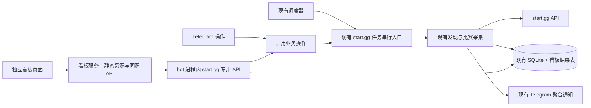

# start.gg 独立实时比赛看板：产品与技术方案

状态：用户已批准，首版进入实现与上线阶段。  
日期：2026-09-19。  
源码基线：`a14b2af`。  
建议项目名：`@notinews/startgg-dashboard`。  
独立目录：`apps/startgg-dashboard/`。
正式访问域名：`https://ftg.xmcloud.buzz`（用户指定）。

## 1. 产品目标与本轮边界

把现有 start.gg 关注与提醒能力变成一个可以长时间打开的个人比赛看板。进入页面后，应立即回答：我关注的比赛现在打到哪里、哪些选手还在比赛、刚刚产生了什么赛果、这些数据是什么时间采集的。

看板以观赛为主，配置为辅。首页不做后台管理表格，不以请求次数、任务数或数据库统计占据首屏。Telegram 继续承担离开页面后的主动提醒，看板负责持续浏览和上下文呈现，两端使用同一套关注与监控结果。

本方案记录完整首版范围和实现边界。用户已批准按方案实现独立应用，审查修复 P0/P1 问题后提交，并沿 GitHub Actions 发布至线上验收。

### 1.1 建议首版包含

- 多赛事概览与单项目比赛看板。
- 正在进行的对局、关注选手状态、已采集的最近赛果。
- Top 16 / Top 32 种子清单、决赛阶段赛果、已有采集能力覆盖的最终 Top 8。
- 赛事发现与候选选择、兴趣确认、选手添加、种子档位、监控开关、立即同步。
- 明确的数据时间、采集状态、错误反馈，以及桌面和手机布局。
- 独立应用目录、独立入口、独立静态产物与服务部署单元。

### 1.2 首版不扩展

完整双败签表编辑器、全球赛事检索平台、直播播放器、直播间推荐、预测胜率、赔率、选手资料百科、年度积分榜、多用户账号系统、通知渠道扩展、历史赛季回填。

这些功能不是现有监控数据换一种呈现即可获得。首版直接提供 start.gg 原项目页和对局页入口，完整签表由原站承载。

## 2. 证据与现状

本次依据当前源码、依赖声明和 start.gg 官方资料编写，没有使用既有 `doc/` 文档作为当前实现依据，没有调查线上实例。下表属于源码事实；后续各节的目录、接口、数据表及页面均为建议设计。

### 2.1 已有能力如何映射到看板

| 已有能力 | 当前实现与限制 | 看板呈现 |
| --- | --- | --- |
| 自动发现赛事 | `startggDiscovery.ts`：街霸 6 候选赛事与关注选手身份匹配，另通过选手近期对局发现活动赛事；并非任意游戏的完整赛事搜索 | “发现赛事”，说明发现范围；无结果不代表全球没有比赛 |
| 按关键词启动 | `runStartggGo` 在已发现的赛事中匹配关键词；存在无匹配、多候选、待确认、已忽略、已启动等结果 | 搜索框用于筛选发现结果，多候选由用户选择 |
| 手动项目链接 | `/watch` 解析项目、长期关注对应游戏并替换当前活动监控项目；该分支本身没有立即采集 | 单独标为“切换监控项目”，展示替换影响 |
| 兴趣确认 | 长期关注游戏、仅关注当前 event、不关注当前 event；临时选择随 tournament 结束时间到期 | 待确认卡，展示大会、比赛项目、游戏和相关选手 |
| 确认后启动 | 关注确认经 `runStartggTask` 调用 `runStartggGo`，要求所选 event 在结果内；同步成功后开启轮询并删除待确认项 | “启动中”完成后才显示“监控中” |
| 固定与手动关注选手 | 固定名单来自 JSON，另可按用户链接或当前项目选手名添加；身份关系落库 | 关注选手区和添加入口，标明固定名单来源 |
| 选手状态 | 最新快照包含胜者组、败者组、淘汰、完成、未参赛，以及名次、最近对局、比分文本 | 选手卡、状态筛选、相关对局 |
| 种子关注 | 全局 `0 / 16 / 32` 档位，实际种子名单按 event 和 phase 保存 | 全局档位控件，各项目自己的种子清单 |
| 决赛阶段 | 从 2–8 个种子的阶段中按顺序选择候选阶段；采集阶段对局，结束时读取最终 Top 8 | 决赛阶段名称、对局列表、最终排名；不统一硬写成 Top 8 阶段 |
| 固定与加速轮询 | 固定每 15 分钟；相关比赛活跃时，完成上一轮后再安排约 2 分钟的加速采集 | 同时显示采集模式、最近成功时间、下一次计划时间 |
| 自动结束 | 完整同步后，活动赛事全部完成或超过大会结束时间 6 小时，关闭轮询；空活动集合也满足当前结束条件 | 区分“官方已完成”“超过时间停止采集”“当前无活动项目” |
| Telegram 通知 | 关注选手、种子、决赛赛果按赛事聚合；另有发送消息记录与去重表 | 与通知共享赛事实体，页面不消费或修改通知去重记录 |
| 清空 | 现有命令停止监控、删除已记录 Telegram 消息，清空赛事与快照等；不等于删除选手和游戏偏好 | 从主看板移出，首版仍保留在 Telegram 中操作 |

### 2.2 不能直接拿来展示的内容

1. `startgg_watch_snapshots` 是按“选手 × 项目”覆盖更新的最新状态，不是选手状态历史。
2. `startgg_pushed_sets` 和 `startgg_event_pushed_sets` 主要保存已推送 ID，不保存完整对阵双方、结果和时间；不能据此重建赛果流。
3. `processEvent` 已获取关注选手、种子选手与决赛阶段的对局，但大量字段只存在于本次任务内存中。最终排名和决赛阶段入围名单也未形成完整的看板读模型。
4. `activeSetCount` 是调度信号：可能按关注选手累计，也可能为已开始的决赛阶段至少加 1。它不是严格去重后的“正在进行场数”。
5. `nextPollAt`、`nextFastPollAt` 来自 bot 进程内的调度器，数据库里的 `polling_enabled` 不能证明进程正在运行。
6. 最近快照时间不能代表所有赛事同步成功；当前定时任务的失败主要写日志，尚无完整的面向页面的采集状态。
7. 比赛项目的 `active` 表示是否纳入监控，不表示该项目正在进行比赛；`final_phase_tracking_completed` 含通知流程语义，不应直接作为比赛完赛依据。

### 2.3 官方接口约束

start.gg 官方限制平均每 60 秒不超过 80 次请求、单次请求不超过 1000 个对象（包含嵌套对象）。因此页面刷新只读取本地结果，不新增一套直接请求 start.gg 的采集器。[官方 Rate Limits](https://developer.start.gg/docs/rate-limits/)

现有客户端有单请求串行限制 `pLimit(1)` 和 15 秒请求超时；串行不等同于满足上述时间窗口限额。首版维持采集周期，不因用户打开更多页面而提高上游请求频率。若实施时调整查询字段或分页，需结合对象数重新确认公开 API 能力；本文不宣称当前查询预算已足够。

## 3. 产品语义：先统一页面说的是什么

| 术语 | 页面含义 |
| --- | --- |
| 大会 / 赛事 | tournament，例如某一届线下大会 |
| 比赛项目 | event，例如该大会的 Street Fighter 6 单人赛；实际监控和临时关注的最小单位 |
| 游戏 | videogame，长期关注的范围 |
| 对局 | set，一场包含若干小局的对阵；首版不显示未采集的小局比分 |
| 参赛单位 | entrant，事件内身份；不把 entrant ID 当作全局 player ID |
| 种子 | 指定阶段的 seed 排位，不是实时积分、最终排名或“当前最强选手” |

页面中的“仅关注本届”明确写成“仅关注本届此项目”。同一大会的另一个 event 不自动视为已关注。长期关注表示允许后续发现的该游戏项目，不承诺轮询关闭后还能持续发现未来赛事。

### 3.1 三类状态分别展示

- **比赛状态**：上游项目状态，以及具体 set 的开始、完成信息。
- **关注状态**：长期关注游戏 / 本届此项目 / 待确认 / 本届忽略。
- **监控状态**：采集中 / 定时采集开启 / 已暂停 / 已停止 / 本次采集失败。

例如“本届已关注 · 监控已暂停”合法，不能合并成一个绿色的“进行中”。保存偏好但启动失败时，明确显示“已保存关注，启动失败”，不制造成功假象。

选手状态沿用现有判定，页面注明它是系统依据已采集赛果推导的状态。无 entrant 映射显示“未匹配到参赛记录”，不能断言选手没有报名。尚无快照显示“等待首次采集”，不能默认成胜者组。`completed` 仅在当前算法的最终第一名条件下产生；页面不能把其他选手都套用该标记。

## 4. 信息架构与视觉布局

### 4.1 路由

| 页面 | 建议路径 | 职责 |
| --- | --- | --- |
| 比赛总览 | `/` | 现在有哪些被监控项目、跨项目进行中对局、关注选手摘要、待确认提示 |
| 单项目看板 | `/events/:eventId` | 该项目完整观赛上下文，支持复制链接直接进入 |
| 关注管理 | `/following` | 全局选手名单、游戏偏好、本届关注及种子设置 |

其中 `eventId` 使用 start.gg 项目 ID，避免把可能在清空后重新分配的本地自增 ID 作为长期链接身份。未解析到外部 ID 的记录只能在列表显示“等待解析”，不生成假详情链接。

单项目详情中用页内标签切换“赛况 / 关注选手 / 种子 / 决赛”。不为每一种筛选增加一层页面。搜索、选手状态筛选、当前标签使用 URL 查询参数保存；浏览选中项目与修改监控项目是两种完全不同的操作。

### 4.2 桌面主看板线框

```text
┌────────────────────────────────────────────────────────────────────┐
│ start.gg 比赛看板   比赛总览 / 关注管理       最近采集 18:02  [同步]  │
│ 定时采集已开启 · 活跃项目约 2 分钟采集        [发现赛事] [监控设置] │
├───────────────┬────────────────────────────────────────────────────┤
│ 当前赛事      │ 大会名称 / 比赛项目                 [start.gg ↗]  │
│ ▸ 大会 A      │ 本届此项目 · 上游进行中 · 采集于 18:02             │
│   项目 A      ├───────────────────────────────┬────────────────────┤
│   项目 B      │ 正在进行                      │ 我的关注选手       │
│ ▸ 大会 B      │ 轮次 · 对阵双方 · 官方比分文本 │ 胜者组 / 败者组    │
│               │ 关注标记 · 对局链接            │ 最近一场 / 名次    │
│ 最近已结束    ├───────────────────────────────┤                    │
│               │ 最新赛果                      ├────────────────────┤
│ 待确认 2      │ 结束时间 · 轮次 · 比分 · 胜者 │ 决赛阶段           │
│               │ [仅关注选手] [种子] [决赛]   │ 阶段 / 最新结果    │
│               │ [更多已采集赛果]              │ [打开决赛视图]     │
└───────────────┴───────────────────────────────┴────────────────────┘
```

视觉方向采用克制的电竞赛事转播记分牌风格：深色中性底色、紧凑而清楚的对阵排版、明确的轮次和状态标识。游戏感主要来自比赛信息的组织方式、数字排版与少量几何细节。对局比分和双方名字是视觉中心；琥珀色标记关注选手，绿色配文字表示对局进行中，红色只表达错误。具体视觉规范见 4.5–4.10。

每张对局卡的阅读顺序：轮次 → 对阵双方 → 官方比分文本 → 胜者/比赛状态 → 采集时间和原站入口。无结构化比分时，完整展示 `displayScore`，不拆字符串猜双方得分；暂无比分写“比分未提供”，不显示虚构的 0:0。

### 4.3 手机布局

顶部保留标题、项目选择和数据时间；下方按“进行中 → 我的关注选手 → 最新赛果 → 决赛摘要”单列排列。赛事导航变成可关闭的选择面板，管理操作进入底部抽屉。

手机不横向缩小桌面三栏，不把首屏塞进全局配置。对局卡允许选手名换行；按行展示比分文本。按钮提供明确文字与足够点击区域；状态不只靠颜色表达。抽屉支持返回关闭与焦点恢复。

### 4.4 各内容区域

**比赛总览**：按大会分组展示项目。优先显示有进行中对局的项目，其次仍监控但无对局进行中的项目，再是最近已完成项目。用户主动选择项目后，不因新的赛果到来自动跳到另一个项目。

**进行中**：只统计采集范围内 `startedAt` 已有值且 `completedAt` 为空的具体 set，按 `eventId + setId` 去重。同一场涉及两位关注选手，同时属于种子和决赛范围，也只有一张卡、多枚来源标签。无数据时写“当前采集范围内暂无进行中对局”，不暗示整场大会没有比赛。

**关注选手**：卡片包含赛事内名字、固定关注标记、推导状态、最近一场、官方名次及快照时间。名次不是最终值时标“当前名次”。按状态筛选，缺少参赛记录单独分组。页内可展开该选手已采集对局，不再向上游发请求。

**最新赛果**：默认最近 20 场，按上游完成时间倒序，时间相同用 set ID 稳定排序。支持仅关注选手、种子、决赛筛选；一个 set 只出现一次。分页只读本地已采集记录。首次接入显示记录覆盖范围，不称为完整历史。

**种子**：展示档位、种子来源阶段、序号、参赛名和同步时间。Top 16/32 是全局档位，不在每张项目卡制造独立设置的错觉。关注选手与种子名单交集用标签标识。

**决赛**：显示真实阶段名及人数，按轮次列出已获取对局。首版用分组列表，不绘制没有晋级连线数据支持的签表。阶段尚未发现、已经发现但未开打、正在进行、已有最终排名，分别呈现。最终排名保留并列名次，不强行生成不同名次；采集范围外的排名不补造。

### 4.5 风格定位：克制的电竞赛事记分牌

用户已明确的方向：**偏游戏风格，但不花哨，聚焦比赛信息。** 以下具体配色、尺寸与组件规则为该方向的设计细化，作为后续实现依据。

整体感受应是“打开就能进入观赛状态”：轮次像赛事转播字幕，选手与赛果像记分牌，阶段切换像比赛项目导航。游戏氛围通过稳定的网格、偏方正的轮廓、有分量的标题和数字建立。

- 主背景保持纯色；卡片靠表面明度和细边线分层，减少阴影。
- 卡片采用小圆角，标题栏可使用短横线、窄色条或小型阶段编号；装饰集中在模块标题和当前选中项。
- 同一区域最多使用一种装饰性几何元素，不叠加切角、斜纹、描边和光晕。
- 首屏主要面积留给对阵、关注选手和赛果；不设置大幅宣传头图、赛事海报墙或占据整屏的英雄区。
- 保持中文为主要交互语言；`VS`、官方阶段名等有比赛语义的英文可以保留，不靠大量英文标签制造电竞感。
- 不使用霓虹泛光、粒子、扫描线、金属纹理、背景视频、故障字、持续呼吸灯或自动播放音效。

### 4.6 配色与表面层级

建议采用“石墨黑 + 冷灰 + 琥珀强调”的固定配色。不同游戏沿用同一套界面色彩，通过游戏名和比赛内容区分，不随游戏切换整站主题。

| 用途 | 建议色值 | 使用规则 |
| --- | --- | --- |
| 页面背景 | `#0E1117` | 覆盖主要背景，保持安静 |
| 导航与基础面板 | `#151B24` | 与背景形成轻微层次 |
| 对局卡、抽屉 | `#1C2430` | 承载重要比赛信息 |
| 分隔线 | `#303B4B` | 1px 细线，避免每个字段都加框 |
| 主文字 | `#F1F5F9` | 选手名、关键比分、主要标题 |
| 次文字 | `#B6C2D2` | 轮次、时间、说明；不通过大幅降低透明度弱化 |
| 强调色 | `#F4B860` | 关注标记、选中指示、主要行动；不用作整张卡背景 |
| 进行中 | `#62D6A4` | 小圆点 + “进行中”文字，静态呈现 |
| 错误 | `#F08080` | 连接或操作失败；不用于败者、淘汰和败者组 |

颜色必须有文字或形状配合：关注用星形图标与“关注”，选中用侧边条或下划线，胜者用“胜”标记，错误用错误说明。金色不同时承担“关注”“冠军”“警告”三种含义；冠军以名次和“冠军”文字突出，停止原因用中性提示解释。

以上色值是设计起点，不视为已经完成所有文字、按钮及焦点组合的可读性定稿。实现时保留文字清晰度，不为营造暗色氛围将时间和状态变成难以辨认的灰字。

### 4.7 字体、数字与信息密度

| 内容 | 桌面建议 | 手机建议 | 规则 |
| --- | --- | --- | --- |
| 当前大会 / 项目标题 | 22–26px，半粗 | 20–22px，半粗 | 不抢占对局区域，长名称允许换行 |
| 模块标题 | 14–16px，半粗 | 14–16px，半粗 | 配合小型数量或阶段标签 |
| 选手名 | 16–18px，半粗 | 15–17px，半粗 | 名字完整性优先于左右绝对对称 |
| 可独立展示的结构化比分 | 28–32px，粗体 | 24–28px，粗体 | 只有数据支持时才使用记分牌大数字 |
| 官方比分文本 | 16–18px，中粗 | 15–17px，中粗 | 可包含选手名，长文本换行，不强行放大整段 |
| 轮次、时间、辅助标签 | 12–13px | 12–13px | 次级但清晰，不能成为一排难读的小字 |

正文使用清晰的系统无衬线字体；不引入装饰性中文字体。比分、种子序号和时间启用等宽数字特性，使刷新前后宽度稳定。当前首版以 `displayScore` 为主，不假设已经具备可拆分的双方分数字段。

采用 4px 间距基准：卡内常用 12–16px，模块之间 16–24px。卡片圆角建议 6–8px；状态标签圆角约 4px，避免所有内容都变成胶囊。桌面比赛内容区占主要宽度，侧边选手区保持辅助比例；手机以单列和换行消化内容，不压缩字体。

### 4.8 对局卡与赛果行的视觉规则

**进行中对局卡**采用三段结构：顶部“官方轮次 + 进行中”，主体“对阵双方 + 官方比分”，底部“来源标签 + 数据时间 + 原站入口”。主体最醒目，`VS` 只作为小型分隔，不做巨大的装饰字。

```text
┌─────────────────────────────────────────────────────┐
│ 官方轮次                              ● 进行中      │
│                                                     │
│ ★ 选手 A                 VS                 选手 B  │
│               官方比分文本 / 比分未提供             │
│                                                     │
│ 关注选手 · 决赛             采集于 18:02  查看对局 ↗ │
└─────────────────────────────────────────────────────┘
```

此线框只说明层级，不是实际比赛记录。双方名字较长或在手机显示时，改为上下两行，比分文本独立一行；不截掉名字的核心部分，不为了固定卡高隐藏对阵信息。

**已结束赛果**采用更紧凑的行式卡片，保留轮次、双方、比分、明确胜者和结束时间。胜者加“胜”标识及字重，败者保持正常可读性，不整行变暗、不加删除线。赛果中的负分、弃权等信息按官方文本呈现，不将它们统一改成常规比分。

**关注选手**使用琥珀色小星标；双方均被关注时，两侧都标记，不能为突出单一“主队”而遗漏另一侧。关注、种子、决赛来源标签均小于名字与比分，不超过必要数量；数量过多时在详情展开。

**尚未提供信息**直接显示“等待首次采集”“比分未提供”等文字，不使用假头像、虚构旗帜、随机战队 Logo 或虚构选手角色立绘来填满卡片。首版不依赖图片素材建立完整视觉效果。

### 4.9 控件、反馈与动效

主要行动采用琥珀色实底配深色文字，但同一个操作区域只突出一个主要按钮；常规导航、原站链接、设置采用中性按钮或文字入口。暂停与恢复用明确文字，不设计含义不明的电源图标。破坏性操作仍不进入主观赛区。

鼠标悬停只提升局部底色或边线；选中状态持续保留，键盘焦点使用清晰描边。手机按钮点击区域建议至少 44px 高，不要求所有桌面赛果行都占相同高度。

动效只辅助理解变化：

- 按钮、标签和抽屉可用约 120–180ms 的淡入或颜色过渡；不做弹跳、翻牌和卡片倾斜。
- 同一对局的比分或状态真正改变时，允许一次短暂的低强度底色提示，约 600–900ms 消退；没有数据变化的轮询不触发动效。
- 不闪烁“进行中”指示、不滚动比分、不在赛果到来时播放庆祝动画或声音。
- 新赛果到达时沿用“有新赛果”提示，由用户决定跳到顶部；不自动滚动或突然重排正在阅读的区域。
- 加载只作用于对应按钮或内容模块，不使用全屏转圈；首次骨架不使用持续扫光。
- 尊重用户减少动态效果的设置；时间、结果和错误提示不能依赖动画才能识别。

### 4.10 视觉交付判定

后续页面应同时满足以下结果：

1. 第一眼先看到比赛项目、对阵双方与赛况；设置按钮、品牌标题和装饰不比比分更醒目。
2. 游戏感来自记分牌排版、轮次标签和方正结构；即使去掉所有图片仍然成立。
3. 进行中、胜者、关注、淘汰、采集失败互不混淆；败者组和淘汰不会被误认为系统错误。
4. 长选手名、长官方比分文本、暂无比分和并列名次均能自然呈现，不靠缩小到难读的文字解决。
5. 长时间停留时页面保持安静；只有真实内容变化和用户操作产生局部反馈。
6. 桌面与手机使用同一套视觉语言，手机保留对阵信息完整性，不照搬桌面三栏。

## 5. 完整交互主路径

### 5.1 首次打开与持续浏览

1. 先渲染常驻标题、导航、项目选择与内容容器；数据区域局部加载。
2. 获取已有看板快照，不触发 start.gg 采集，也不启动 Telegram 推送。
3. 有已监控项目时展示本地最新结果；无项目时解释当前为空，并提供“发现赛事”和“输入项目链接”。
4. 浏览标签、展开选手、切换项目均不改变关注范围、监控开关或种子设置。
5. 已加载项目缓存保留，返回时先呈现原内容和原滚动位置，再更新其数据。

### 5.2 发现、选择、启动

建议把 `runStartggGo` 内部的“发现结果”和“确认启动”拆成可复用的业务步骤，但保留原有 Telegram 主流程。

1. 点击“发现赛事”才执行上游发现。关键词只筛选本次发现结果，不冒充全站搜索。
2. 发现结果明确列出大会和项目；查看候选不立即替换现有监控。
3. 需要兴趣确认时显示三种选择；已经关注的项目可直接进入启动确认。
4. 确认区域列明即将监控哪些项目、是否替换现有项目、是否长期关注游戏。
5. 提交后按钮显示“启动中”，实际完成项目入库、首次采集、种子同步、轮询启用后才显示成功。
6. 失败保留当前卡和用户输入，显示真实错误及已保存的关注状态，用户可主动再次操作；不自动重试。
7. 在 Telegram 已处理同一待确认项时，网页刷新其真实状态，不再接受旧卡片重复确认。

“仅关注本届此项目”复用目前明确要求目标 event 存在的启动路径。当前该路径会按允许的发现结果替换活动监控集合，页面必须展示这个影响，不可呈现为无副作用的“添加一项”。

### 5.3 手动项目链接

保留现有“替换当前监控项目、长期关注对应游戏”的业务语义，按钮写“切换并启动监控”。确认区展示受影响的当前项目。

需要补齐的动作：现有 `/watch <项目链接>` 只完成切换，看板入口需通过同一业务服务继续首次采集并启用轮询。界面不能在仅完成配置写入时报告启动成功。本轮不顺带改变长期关注规则；如果 review 希望链接只关注本届，应作为显式业务变更确认。

### 5.4 暂停、恢复、立即同步

- “暂停监控”停止固定和加速采集，保留关注、快照、赛果；页面仍可浏览。
- “恢复监控”建议使用不清空已有状态的启用方式，并进行一次同步；与现有默认 `resetState=true` 的启用入口区别必须在业务服务中显式处理，不能无意清掉快照和去重记录。
- “立即同步比赛”执行一次完整同步，可能按现有规则产生 Telegram 通知；按钮旁明确这一行为。暂停状态下单次同步不自动恢复轮询。
- 浏览器“重新读取页面数据”只读取本地结果，不等同于“立即同步比赛”。
- 正在执行采集任务时，展示当前任务，重复启动同类采集直接返回忙碌状态，不为每次点击积压上游请求。

### 5.5 选手与种子设置

选手添加复用现有用户链接解析、当前项目内姓名匹配与候选选择。多个同名候选必须选定身份；不扩展为全站模糊搜索。添加后显示“已加入关注，等待同步”，需要立即获取比赛数据时走明确的同步动作。

固定预设名单由 JSON 同步，首版不增加删除/停用入口，避免用户删除后下次又被配置重新加入。游戏偏好首版可浏览并通过兴趣卡新增；取消长期关注与单项目移除不是当前完整主路径，暂不伪装成现成功能。

调整种子档位时标明“影响全部当前监控项目”，同步完成后才切换成功状态。取消设置面板不保存，不触发采集；重新打开读取当前服务端设置，保留已经加载的名单。

### 5.6 结束与清空

官方完赛后保留赛果和已获取最终排名，当前监控停止不导致正在浏览的项目消失。超过大会截止时间而停止采集，只显示对应停止原因，不把项目标为官方完赛。

首版提供最近已采集项目入口，不新增永久历史档案系统。现有明确清空操作将同时清除新增看板记录，沿用其范围；暂停、切换项目、关闭种子均不等于清空赛果。已清空项目的旧链接显示“记录已不存在”。

## 6. “实时”与页面状态模型

### 6.1 更新策略

建议首版采用 **页面每 5 秒读取一次本地看板结果**。它与上游 15 分钟/约 2 分钟采集完全分离，不引入 WebSocket、SSE、消息队列或另一套采集任务。

采用完成一次请求后再安排下一次的方式，避免读取重叠。后台隐藏页面暂停页面读取；重新可见时立即读一次本地结果。读取失败停止本轮自动更新，显式显示“连接中断”和“重新连接”按钮；不增加隐式重试或切换通道。重新连接仅由用户操作触发，标签恢复也不能绕过已显示的错误状态。

这里的“实时”定义为：持续展示系统最新已采集数据。正常连接、前台页面下，新落库结果目标在约 5 秒加本地接口耗时内可见；上游比赛变化仍受赛方录入、上游可见性、现有采集周期和任务耗时影响，不承诺秒级比赛实况。

### 6.2 时间字段

| 字段 | 用途 |
| --- | --- |
| `servedAt` | 本地 API 本次响应时间，不标为“比赛刚更新” |
| `lastAttemptAt` | 最近一次采集尝试时间 |
| `lastSuccessAt` | 对应项目最近一轮完整采集成功时间 |
| `lastFullSuccessAt` | 完整发现/元数据同步时间，与加速采集区别 |
| `capturedAt` | 该选手或对局观测时间 |
| `completedAt` | start.gg 记录的对局完成时间 |
| `nextPollAt / nextFastPollAt` | bot 当前进程实际计划时间；空值不推算填充 |

服务端使用统一时间格式，页面按北京时间展示并注明时区；鼠标悬停或点击相对时间可查看具体时间。无上游完成时间时显示采集时间及其标签，不当作真实赛果发生时间。

### 6.3 局部更新规则

- 常驻应用框架，不因请求切换整页 loading。
- 首次加载只在尚无内容的模块显示骨架；刷新已加载数据保留原内容与时间标签。
- 已选项目、筛选、展开项、滚动位置独立于服务器数据，响应更新不重置这些状态。
- 对局列表以稳定实体 ID 更新；用户正在读旧赛果时显示“有新赛果”，点击后才定位到顶部，避免内容突然挤走。
- 后发的项目选择不能被先发请求的迟到响应覆盖；响应按项目 ID 和请求顺序归属。
- 失败区域保留旧内容并明确“这是上次成功数据”；这是页面状态保留，不是把失败响应伪装为成功。
- 最新一轮部分项目失败时，成功项目可更新各自快照，失败项目保留其上次完整快照及独立错误状态；总体不得报告全部同步成功。

## 7. 独立项目结构与运行边界

```text
apps/startgg-dashboard/
  package.json                 独立依赖声明
  index.html
  vite.config.ts
  tsconfig.json
  src/                         独立 Vue 页面与样式
    app/
    views/
    features/board/
    features/following/
    api/
  server/                      静态资源、会话、bot API 转发
  shared/                      看板自身的接口类型
  public/
  dist/                        独立发布产物

src/services/startgg/
  dashboardReadModel.ts        建议新增：采集结果到看板数据
  controlService.ts            建议新增：两端共用业务操作
  dashboardApi.ts              建议新增：bot 内部 HTTP 适配入口

deploy/startgg-dashboard/      独立服务与反向代理配置
doc/design/startgg/            本专题方案
```

应用不放入 `web/`、`apps/lu-dashboard/` 或 Journal 路由。页面、样式、配置、包名、产物和发布单元均独立；不导入其他 Web 项目组件或运行时代码。

建议沿用仓库已使用的 Vue 3、TypeScript、Vite、Fastify，按独立项目直接声明需要的依赖，不依靠根依赖偶然可解析。此处是技术方向，不是版本锁定结果；当前依据为 manifest 声明，实施前再确认安装版本、公开 API、实际解析和部署产物范围。

Vue 使用 Composition API 和 `<script setup lang="ts">`。视图负责组合，`MatchCard`、`PlayerCard` 等负责展示；状态由看板 composable 管理，筛选通过 `computed` 派生。不主动引入 watch、watchEffect 或动画帧 API。无跨页面复杂需求时不为首版额外创建全局状态框架。

### 7.1 推荐数据链路



bot 是采集任务、关注状态、调度器和数据库写入的唯一所有者。新增看板服务只做界面承载、用户会话和窄范围 API 转发，不启动 bot、不导入 resident 入口、不复制数据库、不直接修改 SQLite。

在 bot 进程内增加只绑定本机地址的 start.gg HTTP 入口，由 `resident.ts` 显式初始化，复用真实 bot 实例和已有调度器。该入口与页面分属不同职责，不意味着将看板应用混入 bot 的页面项目。接口只暴露 start.gg 资源，不开放通用 SQL、任意方法调用或其他提醒数据。

建议看板服务与 bot 同在 `bwgdc01`，独立服务目录与进程。公网仅经看板自身同源入口访问；内部接口不直接暴露公网。个人使用采取一个站点口令的服务端会话即可，不引入账号注册和角色权限。start.gg token 保留在 bot 环境中，不下发浏览器。[官方 Authentication](https://developer.start.gg/docs/authentication/)

## 8. 最小必要的数据补充

### 8.1 已有表继续使用

选手、event、entrant 映射、选手最新快照、种子名单、游戏偏好、临时关注、忽略项、待确认项、轮询设置继续使用已有表。页面需要新的查询聚合，但不另存一套关注关系。

对局、决赛信息和采集状态是新增持久化的必要内容。建议采用以下小范围读模型，不保存全部上游响应，不引入事件溯源系统。

| 建议新增表 | 唯一身份与关键字段 | 解决的问题 |
| --- | --- | --- |
| `startgg_dashboard_sets` | `event_id + set_id`；轮次、原始 state、started/completed 时间、displayScore、winnerId、双方 slots JSON、来源标签、observedAt | 进行中对局、赛果列表、按选手筛选与去重 |
| `startgg_dashboard_event_state` | `event_id`；项目/大会/游戏展示信息、最新官方 eventState、阶段信息、阶段 entrants JSON、最终 standings JSON、snapshotAt | 结束后仍可查看、完整项目快照、决赛与排名 |
| `startgg_dashboard_sync_state` | 项目或全局范围；lastAttemptAt、lastSuccessAt、lastFullSuccessAt、lastError、stopReason | 说明数据新鲜度、错误与停止原因 |

`slots` 至少保存 entrant ID、名字与槽位顺序；不把任意显示名解析成 player 身份。对局来源标签可以多值：关注选手、种子、决赛。最终 standings 保存官方 placement 与 entrant 身份；仍保留并列名次。

项目聚合快照还需包含本轮选手展示状态，确保页面不会从旧读模型和新写入的选手快照拼出一次不存在的整体状态。可将该小规模展示数组放在 `event_state` 的 JSON 中，原有快照表继续服务现有业务，不重构所有旧数据写入。

### 8.2 落库时机与数据一致性

在 `processEvent` 得到本项目完整采集结果后，将本轮关注/种子对局与阶段对局合并去重，以事务写入该项目看板快照与 set 记录；提交后更新项目成功时间。失败不提交本项目半套看板结果，记录错误后仍向调用方报告失败。

已有上游抓取成功、Telegram 发送失败时，两件事分别记录：看板可以展示已成功采集的结果，通知错误显式暴露，不能把通知发送成功作为比赛数据存在的前提。发送去重标记仍由通知流程维护，浏览页面不会改变它们。

加速任务取得新的官方 eventState 时也要更新看板项目状态，不能只在完整同步时刷新。所有进入主采集流程的入口都产出相同读模型，不能仅给网页手动同步补数据。

### 8.3 历史、覆盖与删除

- 初次上线不从 Telegram 文本或推送 ID 猜历史。既有选手快照可展示其真实时间；赛果区明确等待首次采集。
- 正常采集响应中带回的已结束 set 可以保存，不受“是否曾推送”限制，但不额外启动全历史回填。
- 页面明确范围是关注选手、种子和已识别决赛阶段的已采集对局，不是大会全部对局。
- 每次采集应以本轮实际返回的受监控范围更新“当前可见对局集合”，避免已不在响应中的旧进行中记录永久挂在首页；保留已采集赛果，不把查询未返回等同于官方删除。
- 关闭种子关注后，对应旧赛果仍可浏览；已经不在任何当前采集范围内的旧对局不计入“当前进行中”。
- 暂停和自动停止保留数据。现有明确清空路径补充删除新表数据，不发生残留卡片或外键删除失败。
- 首版不设自动历史清理任务；数据只覆盖实际关注范围，后续有真实容量需求再讨论保留周期。

## 9. API 与业务操作边界

以下是拟定契约，当前仓库不存在这些看板接口。浏览器只调用看板服务 `/api/startgg/*`，服务端转发到 bot 的对应内部入口。

### 9.1 读取接口

| 方法与路径 | 返回内容 | 约束 |
| --- | --- | --- |
| `GET /board` | 项目摘要、进行中摘要、待确认计数、运行状态与当前操作 | 只读本地数据与 bot 内存 |
| `GET /events/:eventId` | 项目完整快照、关注选手、种子、决赛、时间与错误 | 不触发采集 |
| `GET /events/:eventId/sets` | 按来源/选手筛选的本地对局，游标分页 | 不查询 start.gg |
| `GET /following` | 选手、偏好、有效本届关注、待确认与全局种子档位 | 过期状态按有效期呈现 |
| `GET /operations/:operationId` | 当前或最近一次操作的真实结果 | 仅用于长任务反馈 |

读取返回 `servedAt`，项目内容携带 `snapshotAt` 和各自错误。数据仍未知用 `null` 和业务说明表达，不能返回默认名次或默认运行状态。

### 9.2 操作接口

| 方法与路径 | 业务结果 |
| --- | --- |
| `POST /discover` | 发现结果与可选项目，不直接启动；同一次结果保留在页面 |
| `POST /monitoring/start` | 对明确选定的发现项目或解析后的链接完成配置、首次同步与轮询启用 |
| `POST /interests/:pendingId` | `follow / event / dismiss`；前两者必须完成真实启动再返回完成 |
| `POST /monitoring/pause` | 关闭固定和加速调度，保留赛果 |
| `POST /monitoring/resume` | 保留状态，首次同步并恢复定时采集 |
| `POST /sync` | 单次完整采集；不隐式修改暂停设置 |
| `POST /players/resolve` | 按输入返回明确身份或多个候选 |
| `POST /players` | 添加已选身份，返回真实关注结果 |
| `PUT /settings/featured-seeds` | `0 / 16 / 32`，同步当前项目种子名单后返回状态 |

变更操作在 bot 内共用服务层，网页和 Telegram 只负责适配输入与结果文案。数据库设置变更、采集、调度启停的顺序由一个业务操作持有；不得在看板服务中直接调用 repository 拼接另一套流程。

### 9.3 长任务和交叉操作

发现与首次同步可能涉及多次上游调用，不让 HTTP 请求一直等待。建议提交后返回 `202 + operationId`，bot 使用现有串行入口执行，页面通过本地读取获得进度和最终结果。只保留当前与最近一次操作结果，不增加持久化任务系统、任务历史页或重放机制。

页面先显示“已接受/等待当前任务完成”，实际开始才显示“采集中”，实际完成才显示成功。失败返回错误、失败步骤和已经生效的关注信息，禁止返回成功占位数据。

bot 重启后，旧操作 ID 显示“操作结果不可用，请重新读取当前状态”，不自动重放变更。关闭页面不取消已接受业务操作。取消输入弹层只撤销尚未提交的选择。

暂停与正在运行的采集必须有明确顺序：已接受的暂停在当前采集结束后生效，在此之前显示“暂停中”，生效后不可由旧任务再次开启加速定时器。Telegram、定时任务和看板共享此串行边界。当前代码只把部分采集体放进队列，实施时需要将相关调度后处理纳入同一边界；不能只为网页加一个独立锁。

网页处理已有 Telegram 兴趣卡后，应编辑原卡或移除按钮，复用 `prompt_message_id`；不为网页每次操作再发送一条操作回执。该效果属于本方案提出的跨入口补充，现有 Telegram 比赛通知保留。

## 10. 前端职责划分

| 模块 | 唯一职责 | 输入与输出 |
| --- | --- | --- |
| `DashboardShell` | 常驻框架、导航、连接提示 | 路由与连接状态；导航事件 |
| `EventNavigator` | 大会分组与项目选择 | 项目摘要、选中 ID；选择事件 |
| `LiveMatches` / `MatchCard` | 已采集对局呈现 | 对局 DTO；展开/原站链接 |
| `FollowedPlayers` / `PlayerCard` | 关注状态与选手详情 | 选手 DTO、筛选；选择选手 |
| `ResultsFeed` | 赛果浏览、筛选与分页 | 对局列表、游标；加载更多 |
| `FinalPhasePanel` | 阶段及排名呈现 | 阶段 DTO，不自行推导晋级关系 |
| `InterestPanel` | 待确认项目与明确操作 | pending DTO、operation；选择事件 |
| `MonitoringControls` | 监控状态与操作反馈 | runtime DTO；暂停/恢复/同步事件 |
| `useBoardData` | 本地 API 读取、实体缓存、请求生命周期 | 接口响应与显式用户动作 |

筛选、排序及来源交集由已有实体数据派生，组件不直接调用 start.gg。页面不注入服务器内部队列、数据库表名、去重机制等实现信息；只在用户需要作决定时说明操作范围、数据时间和失败原因。

## 11. 部署与现有项目隔离

沿用仓库现有 GitHub Actions 发布方式，未来新增看板自己的部署范围与 job，不设计另一条服务器手工发布路径。本轮不调整 workflow。

新增独立包、workspace 条目、独立 `deploy/startgg-dashboard/` 和 `bwgdc01` 看板服务目录。正式访问域名确定为 `https://ftg.xmcloud.buzz`，不再作为实施时待选项。服务端口及服务器目录在实施时依据已有占用情况确定；看板服务不会使用 bot 部署时会清理的工作目录保存自己的发布产物。

现有 workspace 只有 Lu Dashboard；现有 workflow 也没有 start.gg 看板范围。实施时需要同时明确：看板自身改动只发布看板；bot 采集/API 改动发布 bot；包含首次读模型和接口的整批发布先完成 bot，再发布看板。共享锁文件或 workspace 变更当前可能同时命中其他应用发布范围，需在该次接入中准确限定影响。

不复用 Journal 或 Lu 的页面入口、域名路径、容器卷、数据库配置和登录态。看板发布材料只携带其自身静态文件、服务代码及声明的运行依赖；bot 增加的迁移与 API 文件随 bot 现有发布进入服务器。

### 11.1 已确定的域名与访问链路

用户已说明 `xmcloud.buzz` 在其 Cloudflare 账户中管理，并指定 `ftg.xmcloud.buzz` 用于本看板。方案采用这个既有域名，不要求重新购买域名或另选入口。当前会话已提供 Cloudflare API MCP 的查询与执行工具；这说明存在自动化操作入口，不等于本轮已读取目标 zone、确认具体权限或创建 DNS 记录。

```text
https://ftg.xmcloud.buzz
  → Cloudflare 代理
  → bwgdc01 上 ftg.xmcloud.buzz 独立 HTTPS 站点
  → 独立 startgg-dashboard 服务
  → 本机 bot start.gg 内部 API
```

页面与 `/api/startgg/*` 共用该域名。站点根路径直接进入比赛总览，`/events/:eventId` 等前端路由支持直接访问；API 路径由看板服务处理，不返回前端 HTML。站点口令会话限于本看板，不设置覆盖 `xmcloud.buzz` 所有子域的共享登录 Cookie。

### 11.2 Cloudflare MCP 自动化接入

进入已获授权的实施发布阶段后，由代理通过 Cloudflare MCP 完成域名侧配置，作为交付工作的一部分，不将逐项操作 Cloudflare 控制台交给用户。具体顺序如下：

1. 通过 MCP 查询 `xmcloud.buzz` 的 zone 与 `ftg.xmcloud.buzz` 现有记录，并读取与该主机名有关的代理、TLS 和缓存规则，确认真实配置。
2. 根据 `bwgdc01` 的实际公网源站地址形成 DNS 变更。默认使用主机名 `ftg` 的 A 记录并开启代理；仅在源站确有可用 IPv6 时增加 AAAA，不填写猜测的地址。Cloudflare 支持对 A、AAAA、CNAME 记录开启代理。[官方 DNS 记录管理](https://developers.cloudflare.com/dns/manage-dns-records/how-to/create-dns-records/)
3. 已有记录若已符合目标则复用；属于本看板但需调整时按记录 ID 更新。若该主机名已承载其他业务，先明确冲突及影响，不覆盖无关服务。操作范围仅限 `ftg.xmcloud.buzz` 及其必要规则。
4. 在源站应用和 HTTPS 站点就绪后，完成 DNS 接入；读取 MCP 返回的记录 ID、目标值和代理状态，作为域名交付记录。页面部署与域名配置的结果分别记录，不把 DNS 写入成功当作应用发布成功。

MCP 调用前使用工具提供的 API 搜索能力确认对应端点和参数；不在方案中假定固定的账户 ID、zone ID 或已有凭据权限。如实施时工具连接或所需权限缺失，明确指出缺少的连接或权限，不声称自动化已完成，也不私自更换部署架构。

### 11.3 HTTPS、缓存与源站职责

- `ftg.xmcloud.buzz` 使用 HTTPS，源站站点需有覆盖该主机名的有效证书，目标为 Cloudflare 到源站的 Full (strict) 加密。该模式要求源站证书有效且主机名匹配。[官方 Full (strict) 说明](https://developers.cloudflare.com/ssl/origin-configuration/ssl-modes/full-strict/)
- 先读取现有 TLS 设置；已满足要求则复用。需要调整时限定在该主机名适用的配置，不为看板直接改变整个 zone 的模式而影响 Journal、Lu 或其他站点。
- HTTPS 跳转由该独立源站站点配置；不为这个子域额外改动整个 zone 的跳转行为。
- 比赛 API、操作结果及会话响应明确使用 `Cache-Control: no-store`；已有 Cloudflare 自定义缓存规则若会覆盖这些响应，通过 MCP 添加或调整仅针对本主机名相关路径的绕过规则。带内容指纹的静态资源可长期缓存，入口 HTML 保持可及时更新。
- 源站反向代理、证书安装与续期配置、看板服务和 bot 内部 API 随服务器现有发布路径落实。Cloudflare MCP 负责 Cloudflare 资源配置，GitHub Actions 负责应用与源站发布，两者共同完成域名可访问的交付。

### 11.4 发布完成的域名交付内容

正式入口明确交付为 `https://ftg.xmcloud.buzz`，同时记录实际 DNS 指向与代理状态、HTTPS 配置、独立源站服务位置及对应 Actions 发布结果。域名相关变更不影响 `feeds.xmcloud.buzz`、Lu Dashboard 和其他既有服务。

本轮只将域名和自动化流程写入方案；不执行 DNS、证书、服务器或发布配置变更。域名选择已经确认，后续进入发布阶段后不再重复询问使用哪个域名。

## 12. 建议实施批次与交付边界

### 批次 A：可持续浏览的比赛看板

补充对局与项目读模型、同步状态、只读内部 API、独立应用与看板布局。完成真实进行中对局、关注选手、最近赛果、种子、决赛与排名呈现。此批次以只读接入减少对既有提醒流程的影响。

### 批次 B：接通完整监控操作

抽出两端共用业务操作，接入发现、候选选择、兴趣确认、手动项目切换、选手添加、种子设置和监控控制；补齐长任务反馈与两端待确认卡同步。两个批次一起构成本文定义的完整首版，不能将批次 A 宣称为管理能力已全部接通。

### 批次 C：独立发布

以 `https://ftg.xmcloud.buzz` 为正式入口，完成独立服务、现有 Actions 接入与 Cloudflare MCP 域名自动化配置，按第 11 节落实源站 HTTPS 和访问链路。发布是后续独立阶段，不由本方案批准自动推导授权。

### 首版业务完成标准

| 场景 | 用户可观察的结果 |
| --- | --- |
| 第一次进入且暂无赛事 | 框架可见，解释为空的原因，可发现或输入项目 |
| 从 Telegram 启动项目 | 看板出现同一项目和首轮数据，无第二套采集 |
| 网页仅关注本届此项目 | 目标项目真正进入监控，完成后才显示成功 |
| 旧赛事已结束，新项目待启动 | 新项目先同步，不能由旧状态提前停止 |
| 一场对局命中两位关注选手及种子范围 | 页面一张卡，多个来源标记，统计一场 |
| 暂停后再次打开 | 保留赛果，显示暂停，不宣称数据持续更新 |
| 同步失败或 API 429 | 看见错误和原数据时间，无自动重试或虚假成功 |
| 切换项目、标签、取消后再打开操作面板 | 状态与选择可理解，无整页闪现或无意义重载 |
| 刚完成采集，同时请求暂停 | 暂停最终生效，旧任务不重启加速采集 |
| 网页与 Telegram 处理同一兴趣卡 | 一份真实关注状态，过期卡不能重复启动 |
| 官方完赛与超时停止 | 两种文案不同，结果仍可浏览 |
| 清空后访问旧链接 | 明确记录不存在，不残留旧监控结果 |
| 看板发布 | 作为独立项目交付，不混入现有两个 Web 应用 |
| 正式域名接入 | 使用 `https://ftg.xmcloud.buzz`，Cloudflare 配置通过 MCP 完成，应用沿用 Actions 发布，既有子域服务不受影响 |

## 13. Review 重点

已确认要求：独立看板项目、克制且聚焦比赛信息的游戏风格，以及正式域名 `ftg.xmcloud.buzz`；实施发布时通过 Cloudflare MCP 自动化配置域名侧资源。以下产品与技术细节仍供 review，批准前不写入业务代码：

1. **产品形态**：以个人比赛看板为主，附带现有监控操作；默认私有访问。
2. **实时程度**：保留现有上游采集频率，页面约 5 秒读取本地结果，明确标出数据时间。
3. **首版赛况范围**：关注选手、种子和决赛阶段；不承诺全大会全部对局或完整签表。
4. **独立边界**：独立应用和服务，bot 继续唯一负责业务采集与调度，通过内部 API 对接。
5. **管理范围**：支持当前已有添加、确认、切换和轮询能力；不顺带加入删除选手、取消长期关注或历史回填。
6. **已有语义保留**：手动项目链接仍会切换监控并长期关注游戏；“仅关注本届”明确限定到 event。若希望改为追加监控或大会级关注，需要在 review 中单独确认。

## 14. 实现依据索引

以下链接指向本次读取的源码，不表示未来实现文件已经存在：

- [赛事发现](../../../src/services/startggDiscovery.ts)
- [固定选手同步与启动流程](../../../src/services/startggPresetSync.ts)
- [比赛采集、状态推导与通知](../../../src/services/startgg/tracker.ts)
- [上游客户端](../../../src/services/startgg/client.ts) / [GraphQL 查询](../../../src/services/startgg/queries.ts)
- [监控数据仓库](../../../src/services/startggRepository.ts) / [兴趣数据仓库](../../../src/services/startggInterestRepository.ts)
- [固定名单配置读写](../../../src/services/startggPresetConfig.ts)
- [任务串行入口](../../../src/services/startgg/taskQueue.ts) / [定时调度](../../../src/scheduled/jobs.ts)
- [Telegram 交互入口](../../../src/bot/interactive.ts) / [卡片与消息格式](../../../src/formatters/startggFormatter.ts)
- [数据库初始化](../../../src/reminders/db.ts) / [bot 常驻入口](../../../src/resident.ts)
- [workspace 声明](../../../pnpm-workspace.yaml) / [现有发布流程](../../../.github/workflows/deploy.yml)

结论边界：源码支撑现有能力与上述限制；页面设计、读模型、内部 API、更新策略和部署拆分属于拟议方案；线上数据量、实际端到端延迟和新接口运行效果不在本轮证据范围内。
