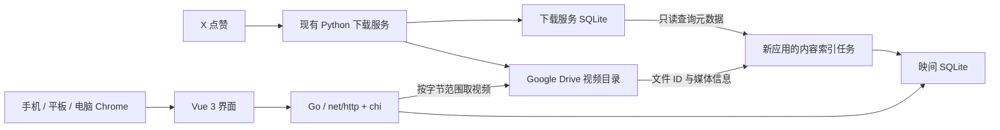

# 映间：私人视频播放器开发设计

日期：2026-10-02  
阶段：开发设计，供 Review  
实现位置：后续独立 Git 仓库 `yingjian`；当前仓库仅保存本文及已确认的需求、原型

## 1. 设计依据与交付目标

依据本轮明确指定的两份材料：

- [产品需求](../requirements/x-liked-video-viewer.md)
- [已认可的 HTML 原型](./x-liked-video-viewer-prototype.html)

保留原型的深色界面、浅绿色强调色、单视频观看主体，以及最新、以前、收藏三个入口。正式版本把示例数据换成真实归档，把浏览器本地收藏换成持久保存的个人收藏，并完成跨设备观看、历史查找和真实播放链路。

手机、平板、电脑都以 Chrome 为主要使用环境。重新打开默认看最新归档；可以方便地翻旧视频、进入收藏；默认自动下一条，随时切换单条循环。成人视频是个人观看内容，本设计直接围绕欣赏和重看展开，不额外增加内容流程。

本文自行确定的实现细节包括：独立 Vue SPA 与 Go 服务、单实例部署、SQLite 保存个人状态、历史记录跨设备共用、Google Drive 同域流式播放，以及简单的个人访问口令。这些是本轮设计决策，不是现有系统已经具备的能力。

## 2. 总体方案

一个独立仓库，一个应用服务，一份自己的 SQLite 数据库。前端和 API 同域；Google Drive 继续保存视频，现有下载脚本继续负责归档。



后端与下载服务同置 `bwgdc01`，便于读取已有记录，不增加跨服务器数据库访问。新服务目录拟为 `/opt/yingjian`，独立容器、独立数据目录、独立发布。该部署位置是本方案的选择，当前尚未创建服务。

应用服务只承担四件事：提供界面和个人会话、维护视频索引、保存收藏与观看位置、把云盘文件流式送给播放器。

### 2.1 本轮已知事实与证据边界

| 事项 | 证据与结论 |
| --- | --- |
| 归档位置 | 前一轮读取的线上配置为 `notinews-drive:X点赞视频`；服务在 `bwgdc01` |
| 元数据 | 下载仓库 `repository.py` 保存作者、正文、推文 ID、媒体标识、远端路径、文件大小、上传时间 |
| 已上传状态 | `media.status='uploaded'` 表示下载服务已完成上传及大小确认 |
| 缺少关联字段 | 下载数据库未保存 Drive 文件 ID；必须建立明确映射 |
| 数据库工作方式 | `repository.py` 启用 SQLite WAL；不得把活跃数据库当作一个普通静态文件读取或复制 |
| 播放方式 | Google 官方文档支持 `files.get` 配合 `alt=media`、`Range` 读取文件内容 |
| 原型范围 | 原型用同一段花园视频模拟四条记录，不能据此断言真实云盘视频的加载、编码及拖动表现 |

当前设计依据是已读取的源码、配置、官方资料和原型。实际 Drive 文件权限、媒体编码、浏览器全屏能力和服务器至观看设备的网络表现，仍是实施时必须拿真实环境落实的前提。

## 3. 技术栈与版本策略

前端采用 Vue 3 稳定生态，服务端采用 Go，兼顾实际产品交付与用户学习 Go 的目标。2026-10-02 已读取前端 npm registry、Go 官方发布信息、Go module proxy 的版本及模块声明；以下作为起始基线。新仓库分别用 `pnpm-lock.yaml` 与 `go.mod/go.sum` 固定依赖。

| 用途 | 选型与本次查询版本 | 使用范围 |
| --- | --- | --- |
| 前端 | Vue `3.5.43` | Composition API、`<script setup lang="ts">` |
| 工具链 | Vite `8.3.2`、`@vitejs/plugin-vue` `6.0.9` | Vue SPA 与前端静态产物 |
| 前端类型 | TypeScript `7.0.2`、Vue language tools `3.3.12` | Vue 组件和 API 响应类型 |
| 路由 | Vue Router `5.3.1` | 个人访问页、常驻观看页 |
| 状态 | Pinia `4.0.3` | 视频队列、收藏状态、观看上下文 |
| 组合工具 | VueUse `15.0.0` | DOM 事件、尺寸变化、页面可见性等实际需要的能力 |
| 无样式组件 | Reka UI `2.10.5` | 弹层、焦点管理、提示等交互基础 |
| 图标 | `lucide-vue-next` `1.0.0` | 播放器与导航图标，统一描边 |
| 样式 | CSS 变量、Grid/Flex、原生 CSS | 直接还原原型视觉，组件内 scoped 样式 |
| 前端工具环境 | Node.js `24` LTS | 仅用于前端依赖与静态产物生成 |
| 服务端语言 | Go `1.27.1` | 单进程服务与独立可执行文件 |
| HTTP 与路由 | 标准库 `net/http` + chi `v5.3.2` | JSON API、路由分组、会话中间件、静态文件 |
| 数据库 | `database/sql` + `modernc.org/sqlite` `v1.60.1` | 纯 Go SQLite 驱动，直接使用参数化 SQL |
| SQL 迁移 | goose `v3.28.0` | 通过库接口应用顺序 SQL 迁移 |
| 个人会话 | `gorilla/securecookie` `v1.1.2` | 认证并加密个人会话 Cookie |
| 口令 | `alexedwards/argon2id` `v1.0.0` | 生成及比对标准编码的 Argon2id 哈希 |
| Google 授权 | `golang.org/x/oauth2` `v0.37.0` | Google OAuth 配置、令牌复用与到期刷新 |
| 请求数据 | `encoding/json` + validator `v10.30.5` | Go DTO 解码与输入字段约束 |
| 前端响应解析 | Zod `4.6.5` | 前端 API 边界解析，与 Go JSON 字段对齐 |
| 时间 | 前端 Day.js `1.11.23`；服务端标准库 `time` | UTC 存储、北京时间月份边界 |
| 固定周期任务 | 标准库 `time.Ticker` + `context` | 每 5 分钟索引和进程退出时取消 |
| 日志 / 媒体流 | 标准库 `log/slog`、`io`、`net/http` | 结构化日志、流式读取与请求取消 |

前端版本依据为 [Vue registry](https://registry.npmjs.org/vue/latest)、[Vite registry](https://registry.npmjs.org/vite/latest)、[Router registry](https://registry.npmjs.org/vue-router/latest)、[Pinia registry](https://registry.npmjs.org/pinia/latest)。Go 版本来自 [Go 官方发布数据](https://go.dev/dl/?mode=json)，后端依赖版本来自各模块在 `proxy.golang.org` 的 `@latest` 与对应 `.mod` 声明。上述 SQLite、OAuth、迁移和 validator 版本的 Go 下限为 1.26，由本方案的 1.27.1 满足；这些是公开声明层面的依据。

公开声明中，Vue 插件支持 Vite 8，Router 5.3.1 支持本方案的 Vue、Pinia 和 Vite 范围；Node 24 满足前端工具要求。声明范围不等同于新仓库实际依赖解析：实施时还须核对组件导出名、类型工具配合、Go 模块的传递依赖与具体 API。线上服务只运行 Go 可执行文件，不需要 Node 运行时。

chi 与标准 `http.Handler` 兼容，便于学习请求、响应、中间件和 context；数据库使用 `database/sql` 保留清楚的 SQL 与事务路径。相关依据见 [chi](https://github.com/go-chi/chi)、[database/sql](https://pkg.go.dev/database/sql)、[modernc SQLite](https://pkg.go.dev/modernc.org/sqlite)。

播放器基于浏览器 `HTMLVideoElement`，界面由 Vue 控制。视频源为现有 MP4 文件；自定义的是播放界面和业务交互，媒体解码、缓冲、Range 请求与音视频同步交给浏览器。滚动使用原生 Scroll Snap，不自行编写惯性或动画引擎。[Vue 发布约定](https://vuejs.org/about/releases.html)、[Vite 环境要求](https://vite.dev/guide/)、[Reka UI 设计方式](https://reka-ui.com/docs/overview/introduction)是对应选型的官方依据。

## 4. 独立仓库与模块边界

仓库建议命名 `yingjian`，界面沿用原型的“映间”。根目录是一个 Go module，`web/` 是独立前端包；两者在同一个 Git 仓库维护，最终交付一个应用镜像。

```text
 yingjian/
 ├─ cmd/yingjian/main.go       # 配置、依赖组装、服务生命周期
 ├─ internal/
 │  ├─ config/                # 配置读取与解析
 │  ├─ httpapi/               # 路由、handler、JSON DTO、错误响应
 │  ├─ auth/                  # 个人口令和会话 Cookie
 │  ├─ catalog/               # 来源查询、文件关联、周期索引
 │  ├─ drive/                 # OAuth、Google 元数据与媒体请求
 │  └─ store/                 # 自有 SQLite 连接及业务 SQL
 ├─ web/
 │  ├─ package.json
 │  ├─ pnpm-lock.yaml
 │  ├─ vite.config.ts
 │  ├─ index.html
 │  └─ src/
 │     ├─ app/                # 路由、入口、全局样式
 │     ├─ components/         # AppShell、LibraryPanel 等界面
 │     ├─ player/             # 视频流、控制栏、媒体事件
 │     ├─ stores/             # catalog、playback
 │     └─ api/                # 同域请求、Zod 与 TypeScript DTO
 ├─ migrations/               # goose 顺序 SQL 文件
 ├─ reference/                # 已确认的需求、设计与 HTML 原型
 ├─ go.mod
 ├─ go.sum
 ├─ Dockerfile
 ├─ compose.yml
 └─ .github/workflows/deploy.yml
```

参考文件在正式开始新仓库时复制进去，后续实现不跨目录导入 MingWorks 源码，不把真实数据或凭据加入仓库。当前仓库和下载仓库本轮均不写业务代码。

Vue 文件按功能命名，通常使用文件名的组件推断名称，不为名称额外接入旧式编译插件。组件通过 props 和 emits 协作；外部 SDK、媒体 DOM 使用 `shallowRef` 或普通引用。数据派生用 `computed`，加载和播放操作由明确事件触发，不串联多个 `watch` 驱动业务。应用代码不使用 RAF。

### 4.1 Go 代码组织与学习路径

业务主路径保持 `路由 → handler → 具体业务方法 / SQL → 响应`，在 `main.go` 显式创建并传入依赖。先使用具体结构体，只有调用方确实需要隔离外部能力时才定义小接口；不为每张表机械增加多层 service 和 repository。

- `httpapi` 解码请求、调用 validator、读取会话，最后转换为 JSON DTO。字段错误与业务不存在分别返回对应状态。
- `store` 使用 `QueryContext`、`ExecContext` 和 `BeginTx`，SQL 与参数放在一起。数据库行类型不直接用作前端响应。
- `catalog` 编排来源读取和 Drive 关联；Drive 网络请求在数据库事务之外完成。
- `drive` 管理一份复用的 HTTP client 与 TokenSource，业务方法接收 `context.Context`，调用者可取消读取。
- 错误向上返回并带操作上下文；在 handler 或索引任务入口记录一次并明确反馈。正常错误不以 panic 表达，也不捕获后继续假装成功。
- goroutine 仅用于服务生命周期和实际后台索引。索引是否进行中通过一处互斥保护，运行结果不会被并发轮次覆盖。

学习时可以依次沿“收藏写入 → 视频查询 → SQLite 事务 → Drive 请求 → 视频流取消 → 周期索引”的实际路径阅读代码；关键注释说明行为和原因，保持项目本身的业务结构。

### 4.2 服务生命周期

启动时按顺序解析配置、打开自有数据库并应用迁移、创建来源连接与 Drive client、挂接路由，再接受请求和启动索引。进程根 context 由系统退出信号取消，停止 ticker 和后台任务；HTTP server 有界地结束正在处理的请求，最后关闭数据库及空闲上游连接。

短 JSON 请求与长媒体流分别设置时间边界：不能把全局几十秒的 handler 超时套在视频传输上。媒体请求连接建立和响应头等待有明确超时，持续传输由客户端连接和请求 context 控制。`time.Ticker` 仅表达固定间隔，不自行解析 cron；时区使用 `time.LoadLocation("Asia/Shanghai")`，运行镜像提供时区数据。[net/http](https://pkg.go.dev/net/http)、[time](https://pkg.go.dev/time#NewTicker)

## 5. 从原型到正式界面

### 5.1 保留的视觉语言

以原型的 `#101113` 主背景、`#191a1d` 面板、`#d7ed9d` 强调色为初始设计变量。保留轻量圆形操作按钮、低对比边界、视频底部渐变、系统中文字体和留白。

“最新”“以前”“收藏”仍是主要入口。桌面侧栏与手机顶部导航表达同一份状态；以前打开查找面板，选中后进入该组视频。观看历史放在“以前”面板内，与按归档月份查找并列。

移除示例影像、虚构标题、装饰性的 `MOMENT 01`、固定总数等演示内容。主画面展示真实作者和正文摘要，不根据视频内容编造标题。队列尾部尚未到达时不显示貌似精确的总条数。

### 5.2 响应式布局

| 可用宽度 | 呈现方式 |
| --- | --- |
| 小于 700px | 视频流占满可用视口；顶部入口、右侧收藏与模式、底部信息和进度叠于画面 |
| 700–1099px | 窄侧栏，视频居中，操作区在侧边；弹层适应平板触摸 |
| 1100px 及以上 | 原型完整侧栏和页头；视频与右侧操作区居中组合 |

断点是初始设计值，不用于推断设备系统。依据实际宽高、输入方式和屏幕方向适配。视口使用 `dvh` 与 safe-area；观看框架高度由容器决定。

竖屏内容保持原型的纵向主体。电脑和平板横屏观看横向视频时，播放器可以扩宽；手机内嵌观看保持完整画面，进入全屏后充分利用横屏空间。视频始终 `object-fit: contain`，原型为示意素材做的裁切不进入真实播放逻辑。

### 5.3 界面组件职责

| 组件 | 单一职责 | 主要输入 / 事件 |
| --- | --- | --- |
| `AppShell` | 常驻导航与响应式框架 | 当前入口；`select-section` |
| `WatchView` | 连接数据与播放器动作 | 编排组件，不堆放媒体逻辑 |
| `VideoFeed` | 整屏滚动与当前条定位 | 队列 ID、active ID；`settled`、`near-end` |
| `VideoSlide` | 单条画面、海报及来源摘要 | 视频、激活状态；`open-details` |
| `PlayerControls` | 播放、进度、音量与全屏 | 媒体状态；`toggle-play`、`seek`、`fullscreen` |
| `VideoActions` | 收藏、连播模式、上一条下一条 | 收藏与模式；对应操作事件 |
| `LibraryPanel` | 月份、搜索、观看历史及结果定位 | 查询与结果；`select-video`、`close` |
| `VideoDetails` | 完整正文与原推文链接 | 当前视频；`close` |
| `AccessView` | 个人口令输入 | 会话结果 |

`usePlayer` 负责媒体事件与播放指令；`useFeedPosition` 负责原生滚动落点；历史位置写入放在 playback store 的明确动作中。只有产生实际重复或独立职责时再细拆模块。

## 6. 播放主路径与连续状态

### 6.1 打开、恢复与入口切换

| 动作 | 行为 |
| --- | --- |
| 关闭后重新打开根地址 | 获取最新队列，第一条从头开始，默认自动下一条 |
| 刷新当前页面 | 使用当前标签页 sessionStorage 中的队列描述、active ID、进度恢复 |
| 切到后台再回来 | 后台暂停；保留位置，回来后由明确播放操作继续，不暗中重置队列 |
| 打开详情或查找面板 | 记录是否正在播放并暂停；关闭面板时仅在原本播放且页面可见时恢复 |
| 面板选中另一条视频 | 切换到所选队列，旧播放恢复意图作废，不能关闭面板后又启动旧视频 |
| 点击“最新” | 明确切到当时最新的队列，从头开始 |
| 进入收藏 | 按收藏时间从新到旧，从该组首条开始 |
| 进入某月份或搜索结果 | 保留结果顺序，从所选条开始，继续观看仍在该组中 |
| 从观看历史继续 | 加载该条保存的位置；已看完的条目从头开始 |

页面路径仅设置 `/` 与 `/access`，查询与弹层属于观看页内部状态，避免每切一条就卸载播放器。浏览器回退优先关闭已打开的辅助面板，回到原观看上下文。队列切换由显式动作完成，不在 route 更新时重复拉取整个页面。

标签页恢复使用浏览器标准 sessionStorage 生命周期及导航类型区分；普通全新进入始终看最新，刷新才读取恢复快照。浏览器“恢复关闭标签页”按恢复场景处理。

### 6.2 播放意图与真实媒体状态

只维护实际需要的状态：当前视频 ID、`playIntent`、`mode`（next / loop）、声音设置、当前媒体事件反映的播放状态。`video.paused`、`ended`、`waiting`、`playing` 等事件是界面状态来源，不能点击后立即把 UI 当作已经成功播放。

首次打开以静音内联播放呈现，开启声音需要明确点击；有声连播受浏览器策略约束。`play()` 被拒绝时停在当前画面，明确显示开始播放按钮；不暗中改声音、不循环调用播放、不跳过当前视频。Chrome 官方明确区分静音与有声自动播放条件，见 [自动播放策略](https://developer.chrome.com/blog/autoplay/)。

每次 `activateVideo(id)` 的顺序：暂停旧视频并记录进度 → 确定新 active ID → 挂接新媒体 → 等待 metadata 后设置正确起点 → 按当前播放意图发起播放。旧视频的迟到事件必须携带自己的 ID，不能更新新视频的进度和标题。

若切换发生在上一条 `play()` 尚未完成时，完成回调仍核对所属 ID；非当前元素立即暂停。无论播放由点击、滑动还是自然结束触发，都走同一入口，不能各自持有独立的自动播放逻辑。

“正常滑到下一条”从头播放；“继续观看历史”才使用保存进度；当前观看会话内回上一条保留该会话的位置。循环回到零不会清除已看记录。

### 6.3 上下滑动、自动下一条与预加载

采用原生纵向滚动容器与 CSS `scroll-snap-type: y mandatory`，每条占一屏，使用 `scroll-snap-align` 和 `scroll-snap-stop`。用原生滚动惯性，避免复刻原型中简单的手势阈值实现。

- 滚动开始离开当前条时暂停声音；`scrollend` 落定后，根据容器高度和落点决定唯一 active ID。
- 滑动取消、最终仍落回原条时，按滑动前的播放意图恢复原进度，不回到零。
- 原地点击播放不会等待一个不存在的 `scrollend` 事件。
- 键盘、侧边按钮和播放结束都调用同一个“移动至相邻条”动作；若落点未改变，不等待滚动事件完成动作。
- 拖动进度条、展开正文和弹层滚动不传递为切换视频；文字输入时不响应播放快捷键。
- 尺寸变化时保留 active ID 和进度，以新的屏高重新对齐，不把旋转屏幕误认作切换。

列表分批加载，每批 20 条，距当前批末尾 3 条时取下一批。已加载条目保留轻量外壳；仅当前条及相邻条持有媒体元素。前一条暂停，下一条仅加载 metadata，其余不保留视频请求。当前始终只有一个有声播放器；不依赖后台播放下一条来“预热”。

`preload` 只是浏览器提示，不能承诺瞬时起播。下一条尚未准备好时，展示它自己的封面与加载反馈。进入新条才开始该条播放，绝不伪装已经播放。

自动下一条与手动切换共用队列；循环模式只重播当前条，仍允许手动滑动。已到最后一条时停留，并明确提示本组已看完，不跨组、不默认从头循环整组。

原生滚动和完成事件依据 [CSS Scroll Snap](https://developer.mozilla.org/en-US/docs/Web/CSS/Guides/Scroll_snap) 与 [scrollend](https://developer.mozilla.org/en-US/docs/Web/API/Element/scrollend_event)。后者属于较新的浏览器能力，支持范围按真实设备上的 Chrome 及其底层引擎确定，不仅看浏览器品牌。

### 6.4 进度、全屏与声音

进度展示由 `timeupdate` 驱动；拖动期间只更新手柄显示，释放时设置 `currentTime`，保留拖动前的播放意图。缓冲条使用 `video.buffered`，不虚构缓冲百分比。

桌面与支持容器全屏的平台，让整个观看容器进入 Fullscreen API，保留自定义操作。iOS/iPadOS 若仅支持媒体原生全屏，则使用对应媒体能力，由系统控制条接管；这是明确的平台呈现差异，按能力决定，不通过异常触发另一实现。退出全屏仍使用原来的 video 元素和时间位置。

手机音量以系统音量为主，界面提供静音切换；电脑提供音量滑块。模式只在本次观看期间保留，重新打开默认 next；音量和静音偏好保存在当前设备。浏览器的限制不转化为“保证所有设备都能无交互有声播放”的承诺。

## 7. 队列、收藏与观看记录

### 7.1 前端状态边界

- `catalogStore`：按 ID 保存视频 DTO、收藏状态、查询结果、分页游标。查询键由入口、月份和搜索词组成。
- `playbackStore`：当前队列上下文、active ID、会话内位置、模式和辅助面板状态。
- 媒体 DOM 与事件属于 `usePlayer`；秒级进度不写入整个视频对象列表，避免反复触发列表更新。

打开已经加载的面板复用结果与滚动位置。请求返回只更新属于自己查询键的数据；用户换查询后取消旧请求，旧响应不覆盖新内容。取消请求是用户切换动作的一部分，真实请求失败必须显示。

新索引完成只更新“有新内容”提示。正在播放的队列保持原位；用户点“最新”或主动刷新该组后才采用新结果。

### 7.2 查询与分页规则

初始采用参数化 SQL 的正文 / 作者包含匹配，配合归档月份范围。月份按北京时间换算成 UTC 的半开区间 `[start, nextMonthStart)`。不根据文件名搜索替代正文记录。

排序明确如下：最新、月份与搜索按 `archived_at DESC, id DESC`；收藏按 `favorited_at DESC, id DESC`；历史按 `last_viewed_at DESC, id DESC`。归档时间取下载服务 `uploaded_at`，不能把 Drive 创建时间或推文时间混作点赞时间。

API 使用最后一条的排序值及 ID 作为游标，避免新增内容造成按页偏移。队列打开时记录 `openedAt`，后续页限定本轮已存在的内容；新归档或新收藏在主动重新进入时出现。已经加载的 ID 顺序是当前观看会话的顺序依据。

`openedAt` 固定的是新增边界，不把会变化的收藏与历史记录伪装成数据库快照。尚未加载的条目按请求当时的收藏 / 历史状态读取；已经加载的条目不因其他设备更新而重新排序。前端按 ID 合并结果，用户主动重新进入该组才重建已加载顺序。

搜索/月份选中中间某条时，保留其所在已加载结果及后续游标，因此上一条、下一条与用户刚看到的结果一致。

### 7.3 收藏

收藏以单个视频为单位，服务端保存一份；每个设备进入收藏时读取同一份数据。

点击立即显示提交中的反馈，但只有服务端确认后才显示已收藏或取消成功。同一条请求未结束时禁止重复点击；失败保留原状态并显示错误，不显示假成功。

在收藏队列取消当前视频时，当前元素及会话队列位置保留，允许播完或主动切走。下一次进入收藏时该条不再出现；不能因为取消收藏让当前播放器卸载。

另一设备修改收藏后，当前正在看的队列不强制跳动；重新打开收藏面板时读取最新结果。不增加实时推送连接。

### 7.4 观看历史与进度

本方案决定将观看历史和进度一起存服务端，三种设备都能主动找回；进入应用的默认位置依然是最新视频。

- 实际播放累计达到 2 秒才建立历史记录；不足 2 秒的短视频在自然结束时记录。
- 正常播放每 5 秒保存位置，暂停、切换、拖动结束和进入后台时提交一次；同一条写入按前端顺序发送，避免旧请求晚到覆盖新位置。
- 前后台切换的最后一次提交使用浏览器允许的 keepalive 请求；不依赖关闭页面事件保证最后一毫秒写入。异常关闭最多可能丢失最近一个保存周期。
- 已看判定采用本次观看的实际播放累计时长达到视频时长的 90%；拖动距离不计播放时长。该标记帮助辨认，不过滤掉旧视频。
- 自然播完保存已完成状态；历史中的“继续”对已完成条目从头开始。
- 同一人同时打开多个设备时，采用服务端最后收到的有效位置；进度不会实时控制其他设备的播放器。

会话内实际播放累计由媒体事件和播放时间变化统计，循环累计不重复制造历史条目。一条视频只保存最近状态，不记录每一次观看流水。

## 8. 内容索引：准确接入已有归档

### 8.1 来源与独立性

新应用自己的 `sourceReader` 直接查询下载服务 SQLite 中 `media.status='uploaded'` 的视频 / animated_gif，并 join `liked_posts` 获取作者和正文。读取内容只限这些业务字段，不调用下载仓库的 `Repository` 构造器，因为它包含建表、更新和提交行为。

使用独立的 `database/sql` 连接池，通过 SQLite URI 的 `mode=ro` 打开来源库；每次索引完成 SELECT 后及时关闭 Rows、结束读取，不跨网络请求持有源数据库事务，不改变源数据库 schema、journal_mode 或业务数据。来源连接与自有数据库连接绝不混用，来源库不交给迁移工具。

**WAL 的部署处理必须明确**：readonly 指数据库查询权限，不代表把整个活动目录挂成只读就一定可用。SQLite 官方说明，只读 WAL 连接需要现有可读的 `-wal/-shm`，或者允许 SQLite 创建辅助文件。为避免下载任务退出清理辅助文件后无法读取，本方案允许源目录中 SQLite 必需的辅助文件创建权限，数据库连接本身保持 readonly；容器仅挂载该来源所需目录，不使用 `immutable` 打开活动数据库，也不复制单独的 `state.db` 当作实时快照。该目录权限是新服务部署的一部分，实施时须按现有属主落实，不能批量改动下载目录权限。[SQLite WAL 说明](https://www.sqlite.org/wal.html)

源数据库结构是唯一的跨仓库接口，集中在 `sourceReader`；后续源字段变化也只调整这里。

### 8.2 Drive 文件对应

配置真实的 `DRIVE_FOLDER_ID`，不在每次播放时按目录中文名称搜索。通过 Drive `files.list` 枚举该目录内未删除的文件，分页读完。取得 ID、name、size、mimeType、modifiedTime、version、canDownload、thumbnailLink 和 videoMediaMetadata。

首次关联规则：源记录 `remote_path` 的文件名，与指定 Drive 目录里的文件名完全相等，并要求文件大小与源记录一致。必须恰好对应一个文件，才保存 Drive ID。

- 零个对应：明确报出源媒体 ID 和远端路径，定位归档与实际文件不一致。
- 多个对应：明确报出重复文件，不能任选第一个。
- 大小不同：直接中止本次索引提交，不能把它当作同一个媒体。

Drive 文件名并不保证唯一，因此不能只把 name 当主键。关联后使用 Drive ID 获取文件；后续索引先核对已绑定 ID，重命名不会创建第二条收藏记录，也不自动换绑到另一个同名文件。

本批来源读取、Drive 分页和关联全部成功后，在新应用数据库中用一次短事务 upsert。外部请求在事务之前完成；失败时整批不提交，记录本次错误，界面准确显示最近一次成功更新时间及当前索引失败，不能宣称内容已经更新。

只对上传完成的来源记录建立条目。云盘中没有对应来源记录的其他文件，不推测作者或用文件名还原正文；源条目与云盘不一致的问题直接列入索引错误。

### 8.3 更新时机

服务启动后安排首次索引，之后每 5 分钟进行一次常规同步，保证手动 `/syncx` 后的新视频不必等到第二天。固定间隔由 Go 标准库 `time.Ticker` 驱动，后台索引使用进程生命周期 context；手动触发后即使对应 HTTP 请求结束，已接受的索引也会继续到本轮完成或明确失败。

观看页提供轻量“更新内容”操作，仅刷新归档索引，不触发 X 下载。一个索引任务进行中时返回正在更新的状态，不并行再开一轮。周期轮次和主动刷新共用同一任务入口。

本轮失败直接结束，不附带重试或替代来源。下一次固定轮次属于正常内容更新，错误状态在新的成功结果产生前一直保留。

### 8.4 海报和媒体信息

海报使用 Drive 提供的 thumbnail，经后端读取并保存到自己的 `posters/` 目录，以 Drive ID 和 version 命名。索引更新后海报按文件版本更新；前端只访问同域的 poster 接口。

thumbnailLink 是短期且可能需要授权的地址，不存成永久公开图片地址，也不把它直接交给浏览器。需要海报时由后端重新取得当前链接再读取，见 [Drive 文件资源](https://developers.google.com/workspace/drive/api/reference/rest/v3/files)。

Drive 暂未提供封面或尺寸时，字段明确为 null，显示“封面尚未就绪”或暂不显示时长；这不等同于视频播放失败。封面请求报错要单独显示，不能用其他图片冒充。主视频可以独立读取。媒体实际时长以浏览器 metadata 为播放控制依据，Drive 元数据用于列表展示。

## 9. Google Drive 播放链路

### 9.1 授权与服务边界

新应用使用自己的 Google OAuth 凭据和离线 refresh token，申请读取视频所需的 Drive 只读范围。由同一个云盘所有者完成一次授权，令牌只存在服务器配置中。不要让新服务和 rclone 共同读写同一个令牌文件。

Google 授权准备属于部署配置，授权客户端状态要允许长期离线使用；不能把短期测试授权当作永久凭据。OAuth 生命周期交给官方库处理，见 [Google Web Server OAuth](https://developers.google.com/identity/protocols/oauth2/web-server)。

Go 的 `drive.Client` 使用 `golang.org/x/oauth2` 的 `Config` 与 Google Endpoint 创建一份共享 TokenSource；复用有效令牌，过期时按正常授权流程刷新。显式确定 Google 的 client credentials 传递方式，不依赖 AuthStyle 自动探测再次发送令牌请求。授权 HTTP client 设置合理的请求期限，令牌刷新失败直接返回错误，不另写 OAuth 协议或刷新循环。[OAuth2 官方包](https://pkg.go.dev/golang.org/x/oauth2)

元数据与媒体请求都使用标准库 `net/http`，通过 OAuth2 Transport 注入 Bearer token；不添加按状态码重试、重新授权后重放媒体请求或替代下载地址。TokenSource 的生命周期属于应用，单次媒体请求的 context 属于当前浏览器请求，二者分开，避免第一次用户切视频就永久取消整个授权对象。

### 9.2 同域媒体接口

```text
video.src = /api/videos/{id}/content
浏览器 Range 请求
  → 核对个人会话与本地视频 ID
  → 查对应 Drive ID
  → 带 Range 请求 Google Drive files.get?alt=media
  → 将响应状态、必要响应头和字节流交给浏览器
```

不先把整个视频下载到服务器或转为前端 Blob。Go 使用 `http.NewRequestWithContext` 发出上游请求，取得状态和响应头后通过 `io.Copy` 将 Body 写到 `http.ResponseWriter`，退出路径始终关闭 Body。标准流式读取保留背压；浏览器拖动会自然发起新的范围请求。官方能力依据是 [Drive 下载文件](https://developers.google.com/workspace/drive/api/guides/manage-downloads) 和 [HTTP Range](https://developer.mozilla.org/en-US/docs/Web/HTTP/Guides/Range_requests)。

| 请求 / 响应 | 处理约定 |
| --- | --- |
| GET，无 Range | 转发上游完整响应，保留真实 Content-Length 与 Content-Type |
| GET，带 Range | 原样传递 Range；保留上游 206、Content-Range、Content-Length，不能返回伪 200 |
| 范围不可满足 | 保留 416 语义和可用的 Content-Range |
| HEAD | 取得文件大小与类型，只返回头，不打开整个媒体流 |
| 正在切视频 / 页面离开 | 取消浏览器媒体读取，后端用请求 context 取消对应上游读取，并关闭响应 Body |
| 媒体获取失败 | 记录本地视频 ID、上游状态与耗时，前端显示当前视频无法播放 |

只转发必要请求头和媒体响应头，不转发用户 Cookie 到 Google。播放器 API 不接受任意上游 URL。反向代理对媒体路径关闭缓存、缓冲和压缩，允许范围请求及客户端中断传播；应用不能把上游 gzip 后的长度当成原始视频字节长度。

媒体响应保留真实的 `Accept-Ranges`，接口使用 `Cache-Control: private, no-store`；列表和个人状态也不进入共享缓存。HEAD 的元数据来自当前文件查询，不用过期索引大小拼装范围响应。标准媒体错误与本地会话失效分别处理，后端不能把 Drive 授权失败误报为用户口令失效。

HTTP 头已经发出后的上游中断终止流，不再尝试向视频响应尾部拼接 JSON；`io.Copy` 的错误必须记录，不能丢弃。浏览器主动取消与真实上游传输失败分别记录。媒体处理保持 Go 标准 handler 的流式行为，不使用会把响应缓存在内存中的 JSON 包装器。所有媒体错误停留在当前条，由用户主动切换。[io.Copy](https://pkg.go.dev/io#Copy)

### 9.3 真实播放的前提

现有下载流程优先选择最高码率 MP4，但 MP4 容器本身不能保证浏览器支持其中的编码。首个真实视频接入阶段就应确认文件编码、Range 响应和 seek 行为；若发现不支持的编码或异常 MP4 结构，回到来源文件处理，不先扩展出一条默认转码流水线。

本方案会消耗服务器向观看设备传输视频的带宽。采用它的理由是同域控制、保持私有文件和完整可控的播放 UI；实际起播速度需要由这条网络路径决定，不能用本地 HTML 的示例视频速度替代结论。

## 10. 应用数据模型

一份 `yingjian.db`，时间统一保存 UTC 毫秒整数，显示与月份筛选使用北京时间。视频 ID 使用本库自增整数；来源 ID 与 Drive ID 分别保存，避免把外部路径当作收藏主键。

### `videos`

| 字段 | 含义 |
| --- | --- |
| `id` | 本库主键 |
| `source_media_id` | 下载库 media.id，唯一 |
| `tweet_id`, `media_key`, `media_index` | 来源媒体身份，组合唯一 |
| `author_id`, `author_username`, `text` | 原始来源信息 |
| `post_created_at`, `archived_at` | 推文时间、上传完成时间 |
| `drive_file_id` | 已确认对应的云盘文件 ID，唯一 |
| `remote_path`, `file_name` | 原始归档路径与当前文件名 |
| `mime_type`, `file_size`, `drive_version` | 文件属性与版本 |
| `width`, `height`, `duration_ms` | 可为空的媒体信息 |
| `poster_path` | 本服务海报文件位置，可为空 |
| `indexed_at` | 最近完成索引时间 |

索引：`(archived_at DESC,id DESC)`；作者和正文先使用个人数据量下直接可读的查询，不预先引入搜索服务。

### `favorites`

`video_id` 主键及外键，`created_at` 为收藏时间。取消收藏只删除本表记录，绝不操作 Drive 或 X 点赞。

### `watch_history`

`video_id` 主键及外键、`position_ms`、`completed_at`（可空）、`last_viewed_at`。没有 user_id，全部数据属于本人。浏览器上报位置，服务端以接收时间更新 last_viewed_at；`completed_at` 一旦建立，不因重看或循环清零。

### `catalog_state`

单行保存 `last_success_at`、`last_attempt_at`、`last_error`。是否正在更新为进程内任务状态，进程退出不留下永久 running 标记。

SQL 迁移由 goose 库按顺序执行，迁移失败直接阻止服务提供新版接口，不自建迁移记录协议。迁移只操作 `yingjian.db`。自有连接池初始限制为一条连接，启用外键和 WAL；操作使用参数化 SQL 与短事务，结束 Rows 后才进行后续查询，事务内部只使用同一个 `sql.Tx`，避免持有连接时再向池申请连接。来源库使用另一个只读连接池。[goose](https://pkg.go.dev/github.com/pressly/goose/v3)、[database/sql](https://pkg.go.dev/database/sql)

## 11. API 契约

JSON 统一使用 camelCase，时间为 UTC 毫秒。Go 的请求和响应 struct 放在 `internal/httpapi`，用显式 `json` tag 定义接口字段；前端在 `web/src/api` 维护对应 Zod schema 并推导 TypeScript 类型，不再假设两种语言可以直接共享类型文件。接口字段调整时同步更新两端和本文契约。

Go 使用 `encoding/json` 解码，validator 表达月份、枚举、数值范围等输入约束，业务方法处理记录是否存在等业务条件。可空字段明确编码为 null，列表无记录时编码为 `[]`，不能因为 Go 零值产生不同接口语义。业务错误返回真实 HTTP 状态和 `{ code, message }`，不返回空数组冒充成功。

| 接口 | 输入 | 返回与作用 |
| --- | --- | --- |
| `GET /api/session` | Cookie | 当前个人会话是否有效 |
| `POST /api/session` | `{ passphrase }` | 成功设置会话；口令错误返回 401 |
| `DELETE /api/session` | Cookie | 清除当前设备会话 |
| `GET /api/videos` | `view=latest/archive/favorites/history`、`month?`、`q?`、`cursor?`、`openedAt?` | `{ items, nextCursor, openedAt }`，每批 20 条 |
| `GET /api/videos/{id}` | 视频 ID | 单条完整 DTO，供历史恢复与详情 |
| `GET /api/library/months` | 无 | 归档月份与各月条数 |
| `PUT /api/videos/{id}/favorite` | `{ favorite: boolean }` | `{ favorite, favoritedAt }`，幂等设置目标值 |
| `PUT /api/videos/{id}/progress` | `{ positionMs, completed }` | 已保存位置和时间 |
| `GET /api/catalog` | 无 | 最近成功索引时间、是否更新中、当前错误 |
| `POST /api/catalog/refresh` | 无 | 接受本轮更新返回 202；已有任务返回 409 |
| `GET/HEAD /api/videos/{id}/content` | Range 等媒体头 | 视频字节流 / 媒体头 |
| `GET /api/videos/{id}/poster` | 无 | 本服务海报图片 |

`VideoSummary` 包含 `id, tweetId, authorUsername, text, archivedAt, durationMs, width, height, favorite, favoritedAt, resumePositionMs, completed, posterAvailable`。媒体地址通过本地 id 构造，接口不暴露令牌或 thumbnailLink。详情额外提供原推文时间和媒体序号。

无封面时，DTO 明确 `posterAvailable=false`，前端不发无意义图片请求。当前用户未登录时媒体接口返回 401，不重定向到 HTML 登录页，避免视频解码器收到网页。

## 12. 个人访问与运行配置

首次在一台设备上访问时输入自己的口令，之后保持登录 30 天。口令通过 `alexedwards/argon2id` 生成和比对编码哈希。会话交给 `gorilla/securecookie` 认证与加密，Cookie 只携带本人已登录的最小状态，解码有效期与 Cookie 的 30 天时长一致，配置 `HttpOnly`、`Secure`、`SameSite=Strict`、`Path=/`。签名密钥和加密密钥分别由服务器配置提供，避免手写加密或引入服务端会话表。

登录成功设置会话，退出清除 Cookie；过期或解码错误明确返回 401。原型风格下提供简短口令页。[securecookie](https://github.com/gorilla/securecookie)、[Argon2id 库](https://github.com/alexedwards/argon2id)

HTML 与前端静态资源可展示入口，视频列表、海报、媒体和写入接口都必须核对会话。口令页不先加载内容；会话失效时停止媒体访问并回到口令输入。收藏和观看进度写入只接收同源 JSON 请求。

必要配置：

| 配置 | 用途 |
| --- | --- |
| `APP_ORIGIN` | 当前正式 HTTPS 入口 |
| `PORT` | 容器服务端口 |
| `DATA_DIRECTORY` | 自有数据库及海报目录 |
| `SOURCE_DATABASE_PATH` | 下载服务数据库路径 |
| `DRIVE_FOLDER_ID` | X 视频实际云盘目录 |
| `GOOGLE_CLIENT_ID/SECRET`、`GOOGLE_REFRESH_TOKEN` | 独立 Google 读取授权 |
| `OWNER_PASSPHRASE_HASH` | 个人口令哈希 |
| `SESSION_AUTH_KEY`、`SESSION_ENCRYPTION_KEY` | Cookie 认证密钥与加密密钥 |

真实凭据由部署环境提供，前端编译环境不得包含 Google 密钥。Go 从环境读取配置，启动时完成解析；日志统一使用 `log/slog`，记录视频 ID、任务结果、HTTP 状态和耗时，不记录完整正文或媒体授权链接。

## 13. 独立发布设计

新仓库拥有自己的 GitHub Actions，发布到 `/opt/yingjian` 的独立容器。多阶段镜像分别使用 Node 24 生成 Vue 静态产物、Go 1.27.1 生成服务可执行文件；最终镜像包含 Go 文件、前端静态目录、SQL 迁移、CA 根证书和时区数据。

`modernc.org/sqlite` 为纯 Go 驱动，配合本方案其余 Go 依赖，按无需 CGO 的单二进制方式交付；最终镜像不安装 Node、前端包或 C 编译环境。产物复制路径显式对应 `web/dist`、应用二进制和 `migrations`，不遗漏运行时读取的 SQL 文件。

Go 通过 `http.FileServer` 提供静态资源。HTML 入口只为 `/` 和 `/access` 明确提供；未知 API 路径返回 JSON 404，缺失的静态文件返回 404，不能把所有请求都映射到 HTML。这样媒体错误不会混入 SPA 页面。

持久内容分别是应用自己的 `data/yingjian.db`、`data/posters/` 和外部凭据。源数据库目录挂载按第 8 节的 WAL 行为处理；不在新镜像中携带源数据库或下载服务代码。

发布路径由新仓库 push main 触发其独立 workflow，使用提交 SHA 标记镜像。当前 MingWorks 的 workflow 不承担新应用发布，下载脚本也无需改动。

正式入口拟沿用 `erin.xmcloud.buzz`，避免增加一个记忆入口。新应用完成后，在明确进入发布阶段时切换该站点反向代理；本次没有授权替换旧服务。该域名当前 DNS、反向代理所在服务器和端口配置尚未读取，切换前必须按实际入口落地，不能直接假定它已经指向 `bwgdc01`。媒体路径遵循第 9 节的直通要求，不把视频交给公共缓存。

## 14. 开发顺序与每步产物

按完整观看路径逐段完成，每段都形成可直接理解的产品行为；美观随功能一起落地，不留到最后另做一轮。

| 顺序 | 开发内容 | 完成时应具备的行为 |
| --- | --- | --- |
| 1 | 在新仓库建立 Go module、HTTP 入口及 Vue 页面、主题、响应式外壳 | 与认可原型保持相同视觉方向，手机、平板、电脑都有完整布局 |
| 2 | Go 个人会话、database/sql 数据访问、只读来源和 Drive ID 关联 | 能看到真实作者、正文与归档记录；对应不清楚的文件明确报错 |
| 3 | Go context 与流式 Range 媒体接口、首个真实视频 | 能播放、暂停、拖进度、切声音、进入和退出全屏 |
| 4 | 原生整屏滚动、相邻条、自动下一条与循环 | 连续切换时画面、文字、声音和进度始终属于当前视频 |
| 5 | 月份、搜索、收藏及收藏队列 | 找得到旧视频；收藏跨设备保存；取消收藏不打断当前播放 |
| 6 | 观看历史、进度保存、刷新和前后台恢复 | 默认仍看最新，主动继续时能找回位置；辅助面板关闭后不重置 |
| 7 | 新内容索引、状态提示与真实数据下的界面收尾 | 新归档可被发现，正在看的内容不被刷新替换，失败原因清楚 |
| 8 | 新仓库的镜像、独立发布配置与入口切换准备 | 应用有自己的交付路径，切换旧域名作为后续发布动作 |

第 3 步是真实媒体主路径成立的关键节点。若遇到源文件编码、云盘权限或网络路径问题，应先解决该根因，再扩大连续观看范围，避免先完善所有界面后才发现实际无法观看。

### 完成交互应覆盖的连续场景

- 首次打开 → 播放 → 上下切换 → 返回上一条 → 切后台 → 回来继续。
- 打开以前 → 选月份 → 搜索 → 选择视频 → 连续播放 → 返回仍保留搜索与位置。
- 进入收藏 → 取消当前收藏 → 当前仍正常播放 → 下一条 → 重新进入收藏后列表已更新。
- 自动下一条 → 切换循环 → 主动滑走 → 取消循环 → 本组末尾正常停止。
- 拖动进度 → 全屏 → 旋转设备 → 退出全屏 → 原视频位置仍正确。
- 索引发现新视频 → 当前观看不跳动 → 主动进入最新 → 看见新内容。

## 15. 实施时需要落实的事实

产品方向和主要实现已经由本文确定，以下属于实施输入，不再展开为新一轮产品选择：

1. 真实 Google Drive 目录 ID 和新应用读取授权。
2. 源数据库属主、WAL 辅助文件生命周期及新容器访问方式。
3. 常用手机和平板的系统、Chrome 版本及媒体全屏能力。
4. 真实视频的编码与范围读取表现，以及 `bwgdc01` 到观看设备的播放链路表现。
5. `erin.xmcloud.buzz` 当前实际入口位置，独立仓库与新服务的最终地址。

本轮交付止于本文。新建仓库、编写业务代码、配置授权和切换服务在后续明确进入相应阶段时实施。
